## Cat Paper Collection

As reported by Cisco, 90% of net traffic will be visual, and indeed, most of the visual data are cat photos and videos. Thus, understanding, modeling and synthesizing our feline friends becomes a more and more important research problem these days, especially for our cat lovers.

**[Cat Paper Collection](http://people.eecs.berkeley.edu/~junyanz/cat/cat_papers.html)** is an academic paper collection that includes computer graphics, computer vision and machine learning papers that produce experimental results related to **cats**. If you want to add/remove your paper to/from the list, please send an email to [Jun-Yan Zhu](http://www.eecs.berkeley.edu/~junyanz/) (junyanz at berkeley dot edu).

<table border="0">

<tbody>

<tr>

<td width="140">[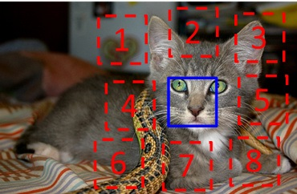](http://graphics.cs.cmu.edu/projects/deepContext/)</td>

<td valign="middle" width="680">

**Unsupervised Visual Representation Learning by Context Prediction**

[Carl Doersch](http://www.cs.cmu.edu/~cdoersch/), [Abhinav Gupta](http://www.cs.cmu.edu/~abhinavg/), [Alexei A. Efros](http://www.eecs.berkeley.edu/~efros/)

In ICCV 2015

**[[Paper]](http://arxiv.org/pdf/1505.05192v2)** **[[Project]](http://graphics.cs.cmu.edu/projects/deepContext/)**

</td>

</tr>

</tbody>

</table>

<table border="0">

<tbody>

<tr>

<td width="140"></td>

<td valign="middle" width="680">

**Physically-Accurate Fur Reflectance: Modeling, Measurement and Rendering**

[Ling-Qi Yan](http://people.eecs.berkeley.edu/~lingqi/), [Chi-Wei Tseng](http://cseweb.ucsd.edu/~c5tseng/), [Henrik Wann Jensen](graphics.ucsd.edu/~henrik/), [Ravi Ramamoorthi](https://cseweb.ucsd.edu/~ravir/)

In SIGGRAPH Asia 2015

**[[Paper]](http://people.eecs.berkeley.edu/~lingqi/publications/paper_fur.pdf)**

</td>

</tr>

</tbody>

</table>

<table border="0">

<tbody>

<tr>

<td width="140">[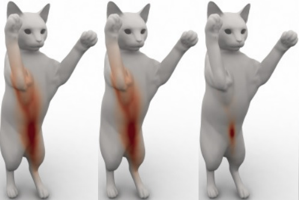](http://people.csail.mit.edu/jsolomon/assets/convolutional_w2.compressed.pdf)</td>

<td valign="middle" width="680">

**Convolutional Wasserstein Distances: Efficient Optimal Transportation on Geometric Domains**

[Justin Solomon](http://people.csail.mit.edu/jsolomon/), [Fernando de Goes](http://fernandodegoes.org/), [Gabriel Peyr¨¦](http://gpeyre.github.io/), [Marco Cuturi](http://www.iip.ist.i.kyoto-u.ac.jp/member/cuturi/), [Adrian Butscher](http://autodeskresearch.com/people/adrianbutscher), Andy Nguyen, Tao Du, [Leonidas Guibas](http://geometry.stanford.edu/member/guibas/)

In SIGGRAPH 2015

**[[Paper]](http://people.csail.mit.edu/jsolomon/assets/convolutional_w2.compressed.pdf)**

</td>

</tr>

</tbody>

</table>

<table border="0">

<tbody>

<tr>

<td width="140"></td>

<td valign="middle" width="680">

**Computational Hydrographic Printing**

Yizhong Zhang, Chunji Yin, [Changxi Zheng](http://www.cs.columbia.edu/~cxz/), [Kun Zhou](http://www.kunzhou.net/)

In SIGGRAPH 2015

**[[Paper]](http://www.cs.columbia.edu/cg/hydrographics/hydrographics.pdf)** **[[Project Page]](http://www.cs.columbia.edu/cg/hydrographics/)**

</td>

</tr>

</tbody>

</table>

<table border="0">

<tbody>

<tr>

<td width="140">[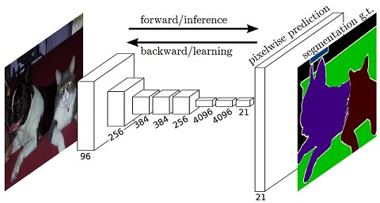](http://people.eecs.berkeley.edu/~jonlong/long_shelhamer_fcn.pdf)</td>

<td valign="middle" width="680">

**Fully Convolutional Networks for Semantic Segmentation**

[Jon Long](http://people.eecs.berkeley.edu/~jonlong/), [Evan Shelhamer](http://imaginarynumber.net/), [Trevor Darrell](http://people.eecs.berkeley.edu/~trevor/)

In CVPR 2015

**[[Paper]](http://people.eecs.berkeley.edu/~jonlong/long_shelhamer_fcn.pdf)**

</td>

</tr>

</tbody>

</table>

<table border="0">

<tbody>

<tr>

<td width="140">[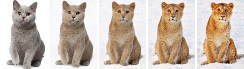](http://research.microsoft.com/en-us/um/people/hoppe/proj/morph/)</td>

<td valign="middle" width="680">

**Automating Image Morphing using Structural Similarity on a Halfway Domain**

Jing Liao, [Rodolfo Lima](http://www.rodlima.net/), [Diego Nehab](http://w3.impa.br/~diego/), [Hugues Hoppe](http://research.microsoft.com/en-us/um/people/hoppe/), [Pedro Sander](http://www.cse.ust.hk/~psander/), [Jinhui Yu](http://www.cad.zju.edu.cn/home/jhyu/English.htm)

In SIGGRAPH 2014

**[[Paper]](http://www.cs.ust.hk/~psander/docs/pixmorph.pdf)** **[[Project Page]](http://research.microsoft.com/en-us/um/people/hoppe/proj/morph/)**

</td>

</tr>

</tbody>

</table>

<table border="0">

<tbody>

<tr>

<td width="140"></td>

<td valign="middle" width="680">

**AverageExplorer: Interactive Exploration and Alignment of Visual Data Collections**

[Jun-Yan Zhu](http://www.eecs.berkeley.edu/~junyanz), [Yong Jae Lee](http://www.cs.ucdavis.edu/~yjlee/), [Alexei A. Efros](http://www.eecs.berkeley.edu/~efros/)

In SIGGRAPH 2014

**[[Paper]](http://www.eecs.berkeley.edu/~junyanz/projects/averageExplorer/averageExplorer.pdf)** **[[Project Page]](http://www.eecs.berkeley.edu/~junyanz/projects/averageExplorer/index.html)**

</td>

</tr>

</tbody>

</table>

<table border="0">

<tbody>

<tr>

<td width="140">[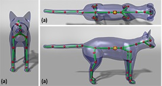](http://graphics.cs.uh.edu/ble/papers/2014s-ske/)</td>

<td valign="middle" width="680">

**Robust and Accurate Skeletal Rigging from Mesh Sequences**

[Binh Huy Le](http://graphics.cs.uh.edu/ble/about.php), [Zhigang Deng](http://graphics.cs.uh.edu/zdeng/)

In SIGGRAPH 2014

**[[Paper]](http://graphics.cs.uh.edu/ble/papers/2014s-ske/skeleton-draft.pdf)** **[[Project Page]](http://graphics.cs.uh.edu/ble/papers/2014s-ske/)**

</td>

</tr>

</tbody>

</table>

<table border="0">

<tbody>

<tr>

<td width="140"></td>

<td valign="middle" width="680">

**Image Completion using Planar Structure Guidance**

[Jia-Bin Huang](https://sites.google.com/site/jbhuang0604/), [Sing Bing Kang](http://research.microsoft.com/en-us/people/sbkang/), [Narendra Ahuja](http://www.ece.illinois.edu/directory/profile.asp?n-ahuja), [Johannes Kopf](http://johanneskopf.de/)

In SIGGRAPH 2014

**[[Paper]](https://www.box.com/shared/static/x3zb7p2qp696dxu3wf34.pdf)** **[[Project Page]](https://sites.google.com/site/jbhuang0604/publications/struct_completion)**

</td>

</tr>

</tbody>

</table>

<table border="0">

<tbody>

<tr>

<td width="140"></td>

<td valign="middle" width="680">

**Context as Supervisory Signal: Discovering Objects with Predictable Context**  
[Carl Doersch](http://www.cs.cmu.edu/~cdoersch/), [Abhinav Gupta](http://www.cs.cmu.edu/~abhinavg/), [Alexei A. Efros](http://www.eecs.berkeley.edu/~efros/)  
In ECCV 2014

**[[Paper]](http://graphics.cs.cmu.edu/projects/contextPrediction/contextPrediction.pdf)** **[[Project Page]](http://graphics.cs.cmu.edu/projects/contextPrediction/)**

</td>

</tr>

</tbody>

</table>

<table border="0">

<tbody>

<tr>

<td>[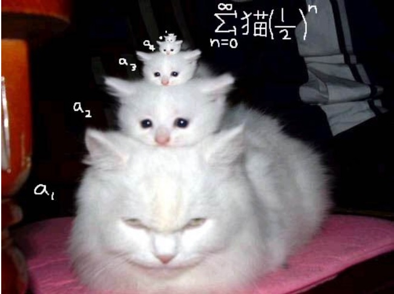](http://www.oneweirdkerneltrick.com/catbasis.pdf)</td>

<td valign="middle" width="680">

**Cat Basis Purrsuit**  
[Daniel Caturana](http://dimatura.net/), [David Furry](http://www.cs.cmu.edu/~dfouhey/)  
In SIGBOVIK 2013

**[[Paper]](http://www.oneweirdkerneltrick.com/catbasis.pdf)**

</td>

</tr>

</tbody>

</table>

<table border="0">

<tbody>

<tr>

<td>[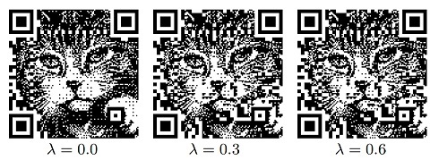](http://vecg.cs.ucl.ac.uk/Projects/SmartGeometry/halftone_QR/halftoneQR_sigga13.html)</td>

<td valign="middle" width="680">

**Halftone QR Codes**  
[Hung-Kuo Chu](http://cgv.cs.nthu.edu.tw/hkchu), Chia-Sheng Chang, [Ruen-Rone Lee](http://www.cs.nthu.edu.tw/~rrlee/rrlee/Home.html), [Niloy J. Mitra](http://www0.cs.ucl.ac.uk/staff/n.mitra/)  
In CVPR 2013

**[[Paper]](http://vecg.cs.ucl.ac.uk/Projects/SmartGeometry/halftone_QR/paper_docs/halftoneQR_sigga13.pdf)** **** **[[Project Page]](http://vecg.cs.ucl.ac.uk/Projects/SmartGeometry/halftone_QR/halftoneQR_sigga13.html)**

</td>

</tr>

</tbody>

</table>

<table border="0">

<tbody>

<tr>

<td>[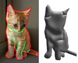](http://www.cs.berkeley.edu/~barron/KarschCVPR2013.pdf)</td>

<td valign="middle" width="680">

**Boundary Cues for 3D Object Shape Recovery**  
[Kevin Karsch](http://kevinkarsch.com/), [Zicheng Liao](http://web.engr.illinois.edu/~liao17/), Jason Rock, [Jonathan T. Barron](http://www.cs.berkeley.edu/~barron/), [Derek Hoiem](http://web.engr.illinois.edu/~dhoiem/)  
In CVPR 2013

**[[Paper]](http://www.cs.berkeley.edu/~barron/KarschCVPR2013.pdf)** 

</td>

</tr>

</tbody>

</table>

<table border="0">

<tbody>

<tr>

<td></td>

<td valign="middle" width="680">

**Painting by feature: texture boundaries for example-based image creation**  
[Michal Lukac](http://dcgi.fel.cvut.cz/people/lukacmi1), [Jakub Fiser](http://dcgi.fel.cvut.cz/people/fiserja9), [Jean-Charles Bazin](https://graphics.ethz.ch/~jebazin/), [Ondrej Jamriska](http://dcgi.fel.cvut.cz/people/jamriond), [Alexander Sorkine-Hornung](http://www.ahornung.net/), [Daniel Sykora](http://dcgi.felk.cvut.cz/home/sykorad/)  
In SIGGRAPH 2013

**[[Paper]](https://s3-us-west-1.amazonaws.com/disneyresearch/wp-content/uploads/20150324052134/Painting-by-Feature-Paper.pdf)** **[[Project Page]](https://graphics.ethz.ch/publications/papers/paperLuk13.php)**

</td>

</tr>

</tbody>

</table>

<table border="0">

<tbody>

<tr>

<td></td>

<td valign="middle" width="680">

**Robust Inside-Outside Segmentation using Generalized Winding Numbers**  
[Alec Jacobson](http://www.cs.columbia.edu/~jacobson/), [Ladislav Kavan](http://www.seas.upenn.edu/~ladislav/), [Olga Sorkine-Hornung](http://igl.ethz.ch/people/sorkine/)  
In SIGGRAPH 2013

**[[Paper]](http://igl.ethz.ch/projects/winding-number/robust-inside-outside-segmentation-using-generalized-winding-numbers-siggraph-2013-jacobson-et-al.pdf)** **[[Project Page]](http://igl.ethz.ch/projects/winding-number/)**

</td>

</tr>

</tbody>

</table>

<table border="0">

<tbody>

<tr>

<td width="210"></td>

<td width="680">

**Manifold Preserving Edit Propagation**

[Xiaowu Chen](http://arts.buaa.edu.cn/staff/chen/index.htm), Dongqing Zou, Qinping Zhao, [Ping Tan](http://www.cs.sfu.ca/~pingtan/)

In SIGGRAPH Asia 2012

**[[Paper]](http://www.cs.sfu.ca/~pingtan/Papers/sigasia12.pdf)**

</td>

</tr>

</tbody>

</table>

<table border="0">

<tbody>

<tr>

<td width="210">[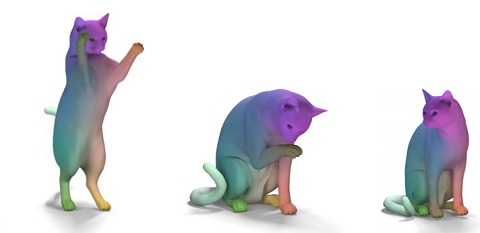](http://citeseerx.ist.psu.edu/viewdoc/download?doi=10.1.1.717.3850&rep=rep1&type=pdf)</td>

<td width="680">

**Functional Maps: A Flexible Representation of Maps Between Shapes.**

[Maks Ovsjanikov](http://www.lix.polytechnique.fr/~maks/), [Mirela Ben-Chen](http://mirela.net.technion.ac.il/), [Justin Solomon](http://people.csail.mit.edu/jsolomon/), [Adrian Butscher](https://autodeskresearch.com/people/adrian-butscher), [Leonidas Guibas](http://geometry.stanford.edu/member/guibas/)

In SIGGRAPH 2012

**[[Paper]](http://citeseerx.ist.psu.edu/viewdoc/download?doi=10.1.1.717.3850&rep=rep1&type=pdf)**

</td>

</tr>

</tbody>

</table>

<table border="0">

<tbody>

<tr>

<td></td>

<td width="680">

**Building High-level Features Using Large Scale Unsupervised Learning**

[Quoc Le](http://cs.stanford.edu/~quocle/), [Marc'Aurelio Ranzato](http://www.cs.toronto.edu/~ranzato/), [Rajat Monga](http://research.google.com/pubs/RajatMonga.html), Matthieu Devin, Kai Chen, [Greg Corrado](http://research.google.com/pubs/GregCorrado.html), [Jeff Dean](http://research.google.com/people/jeff/), [Andrew Ng](http://cs.stanford.edu/people/ang/)

In ICML 2012

**[[Paper]](http://static.googleusercontent.com/media/research.google.com/en/us/archive/unsupervised_icml2012.pdf)** **[[Project Page]](http://research.google.com/archive/unsupervised_icml2012.html)**

</td>

</tr>

</tbody>

</table>

<table border="0">

<tbody>

<tr>

<td>[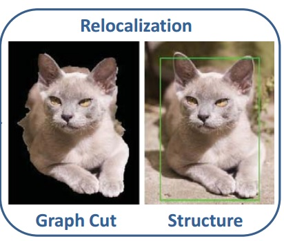](http://web.engr.illinois.edu/~dhoiem/publications/cvpr2012_objectsegmentation_qieyun.pdf)</td>

<td width="680">

**Learning to Localize Detected Objects**

[Qieyun Dai](http://web.engr.illinois.edu/~dai9/) and [Derek Hoiem](http://web.engr.illinois.edu/~dhoiem/)

In CVPR 2012

**[[Paper]](http://web.engr.illinois.edu/~dhoiem/publications/cvpr2012_objectsegmentation_qieyun.pdf)**

</td>

</tr>

</tbody>

</table>

<table border="0">

<tbody>

<tr>

<td width="210"></td>

<td width="680">

**Cats and Dogs**

[Omkar M Parkhi](http://www.robots.ox.ac.uk/~vgg/publications/index.php?idAuthor=161), [Andrea Vedaldi](http://www.robots.ox.ac.uk/~vedaldi/), [Andrew Zisserman](http://www.robots.ox.ac.uk/~az/), [C. V. Jawahar](http://www.iiit.ac.in/~jawahar/)

In CVPR 2012

**[[Paper]](http://www.robots.ox.ac.uk/~vgg/publications/2012/parkhi12a/parkhi12a.pdf) ** **[[Project Page]](http://www.robots.ox.ac.uk/~vgg/publications/2012/parkhi12a/)**

</td>

</tr>

</tbody>

</table>

<table border="0">

<tbody>

<tr>

<td></td>

<td width="680">

**OverCoat: An Implicit Canvas for 3D Painting**

Johannes Schmid, Martin Sebastian Senn, [Markus Gross](https://graphics.ethz.ch/people/grossm/), [Robert W. Sumner](https://graphics.ethz.ch/~sumnerb/)

In SIGGRAPH 2011

**[[Paper]](http://zurich.disneyresearch.com/OverCoat/OverCoat-preprint-s.pdf) ** **[[Project Page]](http://zurich.disneyresearch.com/OverCoat/)**

</td>

</tr>

</tbody>

</table>

<table border="0">

<tbody>

<tr>

<td></td>

<td width="680">

**The Truth About Cats and Dogs**

[Omkar M. Parkhi](http://www.robots.ox.ac.uk/~vgg/publications/index.php?idAuthor=161), [Andrea Vedaldi](http://www.robots.ox.ac.uk/~vedaldi/), [C. V. Jawahar](http://www.iiit.ac.in/~jawahar/), [Andrew Zisserman](http://www.robots.ox.ac.uk/~az/)

In ICCV 2011

**[[Paper]](http://www.robots.ox.ac.uk/~vgg/publications/2011/Parkhi11/parkhi11.pdf) ** **[[Project Page]](http://www.robots.ox.ac.uk/~vgg/publications/2011/Parkhi11/)**

</td>

</tr>

</tbody>

</table>

<table border="0">

<tbody>

<tr>

<td></td>

<td width="680">

**Mobius Voting for Surface Correspondence**

[Yaron Lipman](http://www.wisdom.weizmann.ac.il/~ylipman/), [Thomas Funkhouser](http://www.cs.princeton.edu/~funk/)

In SIGGRAPH 2009

**[[Paper]](http://gfx.cs.princeton.edu/pubs/Lipman_2009_MVF/mobius.pdf) ****[[Project Page]](http://gfx.cs.princeton.edu/pubs/Lipman_2009_MVF/index.php/)**

</td>

</tr>

</tbody>

</table>

<table border="0">

<tbody>

<tr>

<td>[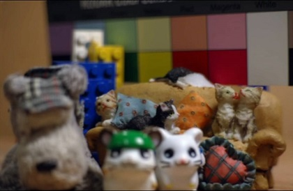](http://chiakailiang.org/pap/)</td>

<td width="680">

**Programmable Aperture Photography: Multiplexed Light Field Acquisition**

[Chia-Kai Liang](http://chiakailiang.org/), [Tai-Hsu Lin](http://mpac.ee.ntu.edu.tw/~lth/), Bing-Yi Wong, Chi Liu, [Homer Chen](http://www.ee.ntu.edu.tw/bio?id=60)

In SIGGRAPH 2008

**[[Paper]](http://chiakailiang.org/pap/pdf/sig08_preprint.pdf) ** **[[Project Page]](http://chiakailiang.org/pap/)**

</td>

</tr>

</tbody>

</table>

<table border="0">

<tbody>

<tr>

<td></td>

<td width="680">

**Cat Head Detection - How to Effectively Exploit Shape and Texture Features**

Weiwei Zhang, [Jian Sun](http://research.microsoft.com/en-us/people/jiansun/), [Xiaoou Tang](http://www.ie.cuhk.edu.hk/people/xotang.shtml)

In ECCV 2008

**[[Paper]](http://research.microsoft.com/pubs/80582/ECCV_CAT_PROC.pdf) ** **[[Project Page]](http://137.189.35.203/WebUI/CatDatabase/catData.html)**

</td>

</tr>

</tbody>

</table>

<table border="0">

<tbody>

<tr>

<td></td>

<td width="680">

**Harmonic Skeleton for Realistic Character Animation**

[Grégoire Aujay](http://gregoire.aujay.free.fr/news.php), [Franck Hetroy,](http://morpheo.inrialpes.fr/people/hetroy/) [Francis Lazarus](http://www.gipsa-lab.grenoble-inp.fr/~francis.lazarus/), Christine Depraz

In Symposium on Computer Animation (SCA) 2007

**[[Paper]](http://www-evasion.imag.fr/Publications/2007/AHLD07/HarmonicSkeleton.pdf) ** **[[Project Page]](http://www-evasion.imag.fr/Publications/2007/AHLD07/)**

</td>

</tr>

</tbody>

</table>

<table border="0">

<tbody>

<tr>

<td></td>

<td width="680">

**Hybrid Images**

[Aude Oliva](http://cvcl.mit.edu/), [Antonio Torralba](http://web.mit.edu/torralba/www/), [Philippe G. Schyns](http://www.gla.ac.uk/researchinstitutes/neurosciencepsychology/staff/philippeschyns/)

In SIGGRAPH 2006

**[[Paper]](http://cvcl.mit.edu/hybridimage/hybrid/OlivaTorralb_Hybrid_Siggraph06.pdf) ** **[[Project Page]](http://cvcl.mit.edu/hybridimage/)**

</td>

</tr>

</tbody>

</table>

<table border="0">

<tbody>

<tr>

<td></td>

<td width="680">

**Real-Time Video Abstraction**

[Holger Winnemoller](http://holgerweb.net/PhD/), [Sven C. Olsen](http://www.cs.northwestern.edu/~sco590/), [Bruce Gooch](http://www.cs.northwestern.edu/~bgooch/Publications.html)

In SIGGRAPH 2006

**[[Paper]](http://www.heathershrewsbury.com/dreu2010/wp-content/uploads/2010/07/RealTimeVideoAbstraction.pdf)** **[[Project Page]](http://holgerweb.net/PhD/Research/VideoAbstraction/)**

</td>

</tr>

</tbody>

</table>

<table border="0">

<tbody>

<tr>

<td>[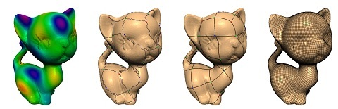](http://graphics.cs.illinois.edu/papers/ssq)</td>

<td width="680">

**Spectral Surface Quadrangulation**

Shen Dong, [Peer-Timo Bremer](http://faculty.engineering.ucdavis.edu/bremer/), [Michael Garland](http://mgarland.org/), [Valerio Pascucci](http://www.pascucci.org/), [John C. Hart](http://graphics.cs.illinois.edu/~jch/)

In SIGGRAPH 2006

**[[Paper]](https://www.microsoft.com/en-us/research/publication/large-mesh-deformation-using-the-volumetric-graph-laplacian/)**

</td>

</tr>

</tbody>

</table>

<table border="0">

<tbody>

<tr>

<td>[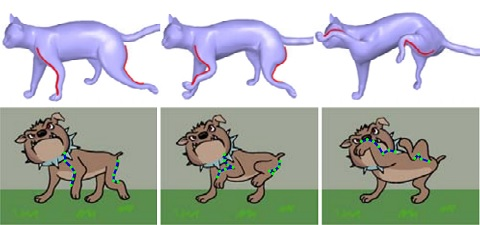](https://www.microsoft.com/en-us/research/publication/large-mesh-deformation-using-the-volumetric-graph-laplacian/)</td>

<td width="680">

**Large mesh deformation using the volumetric graph Laplacian**

[Kun Zhou](http://www.kunzhou.net/), [Jin Huang](http://www.cad.zju.edu.cn/home/hj/index.xml), [John Snyder](http://research.microsoft.com/en-us/um/people/johnsny/), [Xinguo Liu](http://www.cad.zju.edu.cn/home/xgliu/), [Hujun Bao](http://www.cad.zju.edu.cn/home/bao/), [Baining Guo](https://www.microsoft.com/en-us/research/people/bainguo/), [Heung-Yeung Shum](https://news.microsoft.com/exec/harry-shum/#sm.0000132byn4sagcq3zb3rckw1y2ny),

In SIGGRAPH 2006

**[[Paper]](https://www.microsoft.com/en-us/research/publication/large-mesh-deformation-using-the-volumetric-graph-laplacian/)**

</td>

</tr>

</tbody>

</table>

<table border="0">

<tbody>

<tr>

<td>[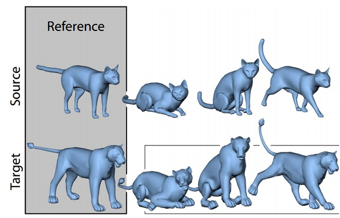](http://people.csail.mit.edu/sumner/research/deftransfer/)</td>

<td width="680">

**Deformation Transfer for Triangle Meshes**

[Robert W. Sumner](https://graphics.ethz.ch/~sumnerb/) , [Jovan Popovic](http://www.adobe.com/technology/people/seattle/jovan-popovic.html)

In SIGGRAPH 2004

**[[Paper]](http://people.csail.mit.edu/sumner/research/deftransfer/Sumner2004DTF.pdf) ** **[[Project Page]](http://people.csail.mit.edu/sumner/research/deftransfer/)**

</td>

</tr>

</tbody>

</table>

<table border="0">

<tbody>

<tr>

<td></td>

<td width="680">

**A Procedural Approach to Authoring Solid Models**

[Barbara Cutler](http://www.cs.rpi.edu/~cutler/), [Julie Dorsey](http://graphics.cs.yale.edu/site/people/julie-dorsey/), [Leonard McMillan](http://www.csbio.unc.edu/mcmillan/index.py), [Matthias Mueller](http://matthias-mueller-fischer.ch/), [Robert Jagnow](http://www.robjagnow.com/)

In SIGGRAPH 2002

**[[Paper]](http://people.csail.mit.edu/bmcutler/PROJECTS/SIGGRAPH02/papers_0040_final.pdf) ** **[[Project Page]](http://people.csail.mit.edu/bmcutler/PROJECTS/SIGGRAPH02/)**

</td>

</tr>

</tbody>

</table>

<table border="0">

<tbody>

<tr>

<td>[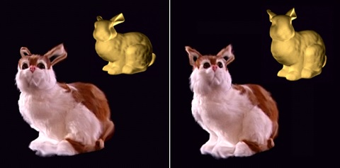](http://dl.acm.org/citation.cfm?id=566602)</td>

<td width="680">

**Feature-based light field morphing**

Zhunping Zhang, Lifeng Wang, [Baining Guo](https://www.microsoft.com/en-us/research/people/bainguo/), [Heung-Yeung Shum](https://news.microsoft.com/exec/harry-shum/#sm.0000132byn4sagcq3zb3rckw1y2ny)

In SIGGRAPH 2002

**[[Paper]](http://dl.acm.org/citation.cfm?id=566602)**

</td>

</tr>

</tbody>

</table>

<table border="0">

<tbody>

<tr>

<td></td>

<td width="680">

**Texture Synthesis over Arbitrary Manifold Surfaces**

[Li-Yi Wei](http://www.liyiwei.org/) and [Marc Levoy](http://graphics.stanford.edu/~levoy/)

In SIGGRAPH 2001

**[[Paper]](http://graphics.stanford.edu/papers/texture-synthesis-sig01/texture.pdf) ** **[[Project Page]](http://graphics.stanford.edu/papers/texture-synthesis-sig01/)**

</td>

</tr>

</tbody>

</table>

<table border="0">

<tbody>

<tr>

<td></td>

<td width="680">

**Real-Time Fur over Arbitrary Surfaces**

Jerome E. Lengyel, [Emil Praun](http://www.cs.utah.edu/~emilp/), [Adam Finkelstein](https://www.cs.princeton.edu/~af/) and [Hugues Hoppe](http://research.microsoft.com/en-us/um/people/hoppe/)

In SIGGRAPH 2001

**[[Paper]](http://people.csail.mit.edu/ericchan/bib/pdf/p227-lengyel.pdf)**

</td>

</tr>

</tbody>

</table>

<table border="0">

<tbody>

<tr>

<td></td>

<td width="680">

**A Signal-Processing Framework for Inverse Rendering**

[Ravi Ramamoorthi](https://cseweb.ucsd.edu/~ravir/) and [Pat Hanrahan](https://graphics.stanford.edu/~hanrahan/)

In SIGGRAPH 2001

**[[Paper]](https://graphics.stanford.edu/papers/invrend/invrend.pdf) ** **[[Project Page]](https://graphics.stanford.edu/papers/invrend/)**

</td>

</tr>

</tbody>

</table>

<table border="0">

<tbody>

<tr>

<td></td>

<td width="680">

**A Markovian framework for digital halftoning**

[Robert Geist](https://people.cs.clemson.edu/~geist/homepage.html), Robert Reynolds, Darrell Suggs

In ACM Transactions on Graphics (TOG) 1993

**[[Paper]](http://dl.acm.org/citation.cfm?id=151281)**

</td>

</tr>

</tbody>

</table>

<table border="0">

<tbody>

<tr>

<td></td>

<td width="680">

**Some informational aspects of visual perception**

[Fred Attneave](http://psycnet.apa.org/index.cfm?fa=buy.optionToBuy&id=1994-31267-001)

In Psychological Review 61.3 (1954)

**[[Paper]](http://web.mit.edu/persci/classes/papers/Attneave54.pdf)**

</td>

</tr>

</tbody>

</table>

Last updated on June 2016\.

<noscript></noscript>

