## Cat Paper Collection

As reported by Cisco, 90% of net traffic will be visual, and indeed, most of the visual data are cat photos and videos. Thus, understanding, modeling, and synthesizing our feline friends becomes a more and more critical research problem these days, especially for our cat lovers.

**Cat Paper Collection** is an academic paper collection that includes computer graphics, computer vision, and machine learning papers that produce experimental results related to **cats**. If you want to add/remove an article, please send an email to [Jun-Yan Zhu](https://github.com/junyanz/) (junyanz at cs dot cmu dot edu). We thank all the authors for their contribution and support.

See also [Webpage](http://www.cs.cmu.edu/~junyanz/cat/cat_papers.html) | [CSV file](https://github.com/junyanz/CatPapers/blob/master/data/reference.csv)

 

<table> <tbody> <tr> <td align="left" width=250>
<a href="https://arxiv.org/abs/2203.08140">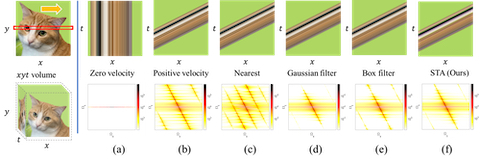</a></td>
<td align="left" width=550>Learning Spatio-Temporal Downsampling for Effective Video Upscaling 
<a href="https://engineering.purdue.edu/people/xiaoyu.xiang.1">Xiaoyu Xiang</a>, 
<a href="https://yapengtian.org/">Yapeng Tian</a>, 
<a href="https://apvijay.github.io/">Vijay Rengarajan</a>, 
Lucas Young, 
<a href="https://scholar.google.com/citations?user=GwGsvm0AAAAJ&hl=en">Bo Zhu</a>, 
Rakesh Ranjan 
In ECCV 2022 
<a href="https://arxiv.org/abs/2203.08140">[Paper]</a> 
</td></tr></tbody></table>

<table> <tbody> <tr> <td align="left" width=250>
</td>
<td align="left" width=550>BANMo: Building Animatable 3D Neural Models from Many Casual Videos 
<a href="https://gengshan-y.github.io/">Gengshan Yang</a>, 
<a href="https://minhpvo.github.io/">Minh Vo</a>, 
<a href="https://nneverova.github.io/">Natalia Neverova</a>, 
<a href="http://www.cs.cmu.edu/~deva/">Deva Ramanan</a>, 
<a href="https://www.robots.ox.ac.uk/~vedaldi/">Andrea Vedaldi</a>, 
<a href="https://jhugestar.github.io/">Hanbyul Joo</a> 
In CVPR 2022 
<a href="https://arxiv.org/abs/2112.12761">[Paper]</a> 
<a href="https://banmo-www.github.io/">[Project]</a>
</td></tr></tbody></table>

<table> <tbody> <tr> <td align="left" width=250>
<a href="https://arxiv.org/abs/2203.14863">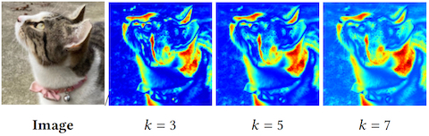</a></td>
<td align="left" width=550>HIME: Efficient Headshot Image Super-Resolution with Multiple Exemplars 
<a href="https://engineering.purdue.edu/people/xiaoyu.xiang.1">Xiaoyu Xiang</a>, 
Jon Morton, 
<a href="https://fitsumreda.github.io/">Fitsum A Reda</a>, 
Lucas Young, 
<a href="https://fperazzi.github.io/">Federico Perazzi</a>, 
Rakesh Ranjan, 
<a href="https://sites.google.com/view/amitumd/home?authuser=0">Amit Kumar</a>, 
<a href="http://andreacolaco.info/">Andrea Colaco</a>, 
<a href="https://engineering.purdue.edu/~allebach/">Jan Allebach</a> 
In ArXiv 2022 
<a href="https://arxiv.org/abs/2203.14863">[Paper]</a> 
</td></tr></tbody></table>

<table> <tbody> <tr> <td align="left" width=250>
</td>
<td align="left" width=550>Flow-edge Guided Video Completion 
<a href="http://chengao.vision/">Chen Gao</a>, 
Ayush Saraf, 
<a href="https://filebox.ece.vt.edu/~jbhuang/">Jia-Bin Huang</a>, 
<a href="https://johanneskopf.de/">Johannes Kopf</a> 
In ECCV 2020 
<a href="https://arxiv.org/pdf/2009.01835.pdf">[Paper]</a> 
<a href="http://chengao.vision/FGVC/">[Project]</a>
</td></tr></tbody></table>

<table> <tbody> <tr> <td align="left" width=250>
<a href="http://kaiyuyue.com/mgd/">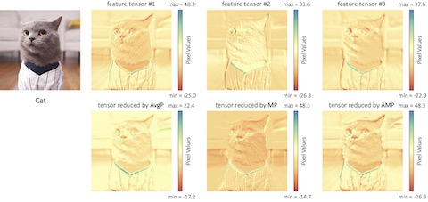</a></td>
<td align="left" width=550>Matching Guided Distillation 
<a href="https://kaiyuyue.com/">Kaiyu Yue</a>, 
Jiangfan Deng, 
<a href="http://www.f-zhou.com/">Feng Zhou</a> 
In ECCV 2020 
<a href="https://arxiv.org/pdf/2008.09958.pdf">[Paper]</a> 
<a href="http://kaiyuyue.com/mgd/">[Project]</a>
</td></tr></tbody></table>

<table> <tbody> <tr> <td align="left" width=250>
<a href="https://ieeexplore.ieee.org/document/8703138">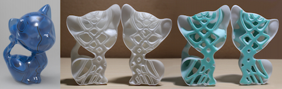</a></td>
<td align="left" width=550>Strong 3D Printing by TPMS Injection 
Xin Yan, 
Cong Rao, 
Lin Lu, 
<a href="https://www.cs.bgu.ac.il/~asharf/">Andrei Sharf</a>, 
<a href="http://irc.cs.sdu.edu.cn/~zhaohaisen/">Haisen Zhao</a>, 
<a href="https://cfcs.pku.edu.cn/baoquan/">Baoquan Chen</a> 
In IEEE TVCG 2019 
<a href="https://ieeexplore.ieee.org/document/8703138">[Paper]</a> 
</td></tr></tbody></table>

<table> <tbody> <tr> <td align="left" width=250>
<a href="http://cvil.eecs.yorku.ca/projects/public_html/wb_emulation/index.html">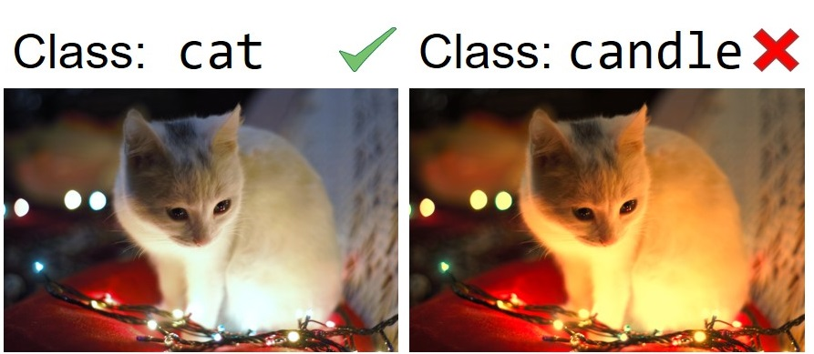</a></td>
<td align="left" width=550>What Else Can Fool Deep Learning? Addressing Color Constancy Errors on Deep Neural Network Performance 
<a href="https://sites.google.com/view/mafifi">Mahmoud Afifi</a>, 
<a href="http://www.cse.yorku.ca/~mbrown/">Michael S Brown</a> 
In ICCV 2019 
<a href="https://arxiv.org/pdf/1912.06960.pdf">[Paper]</a> 
<a href="http://cvil.eecs.yorku.ca/projects/public_html/wb_emulation/index.html">[Project]</a>
</td></tr></tbody></table>

<table> <tbody> <tr> <td align="left" width=250>
<a href="https://github.com/NVlabs/stylegan">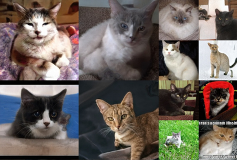</a></td>
<td align="left" width=550>A Style-Based Generator Architecture for Generative Adversarial Networks 
<a href="https://research.nvidia.com/person/tero-karras">Tero Karras</a>, 
<a href="https://users.aalto.fi/~laines9/">Samuli Laine</a>, 
<a href="https://research.nvidia.com/person/timo-aila">Timo Aila</a> 
In CVPR 2019 
<a href="https://arxiv.org/abs/1812.04948">[Paper]</a> 
<a href="https://github.com/NVlabs/stylegan">[Project]</a>
</td></tr></tbody></table>

<table> <tbody> <tr> <td align="left" width=250>
<a href="https://github.com/AlexiaJM/RelativisticGAN">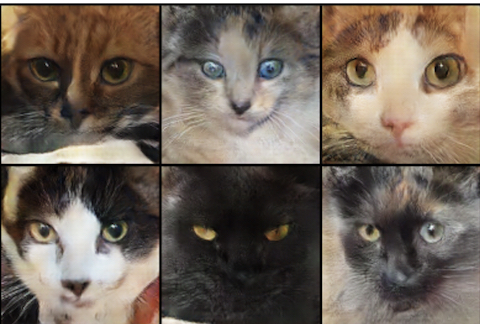</a></td>
<td align="left" width=550>The relativistic discriminator: a key element missing from standard GAN 
<a href="https://ajolicoeur.wordpress.com/">Alexia Jolicoeur-Martineau</a> 
In arXiv 2018 
<a href="https://arxiv.org/pdf/1807.00734.pdf">[Paper]</a> 
<a href="https://github.com/AlexiaJM/RelativisticGAN">[Project]</a>
</td></tr></tbody></table>

<table> <tbody> <tr> <td align="left" width=250>
<a href="http://irc.cs.sdu.edu.cn/DSCarver/">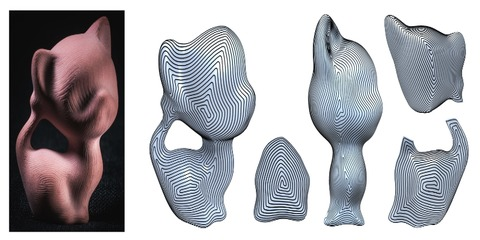</a></td>
<td align="left" width=550>DSCarver: Decompose-and-Spiral-Carve for Subtractive Manufacturing 
<a href="http://irc.cs.sdu.edu.cn/~zhaohaisen/">Haisen Zhao</a>, 
<a href="http://www.cs.sfu.ca/~haoz/">Hao Zhang</a>, 
<a href="https://sites.google.com/site/xinshiqing/">Shiqing Xin</a>, 
Yuanmin Deng, 
Changhe Tu, 
<a href="https://i.cs.hku.hk/~wenping/">Wenping Wang</a>, 
<a href="http://www.cs.tau.ac.il/~dcor/">Daniel Cohen-Or</a>, 
<a href="http://www.cs.sdu.edu.cn/~baoquan/">Baoquan Chen</a> 
In SIGGRAPH 2018 
<a href="http://irc.cs.sdu.edu.cn/DSCarver/files/DSCarver.pdf">[Paper]</a> 
<a href="http://irc.cs.sdu.edu.cn/DSCarver/">[Project]</a>
</td></tr></tbody></table>

<table> <tbody> <tr> <td align="left" width=250>
<a href="http://fve.bfa.edu.cn/recap/nbbs/">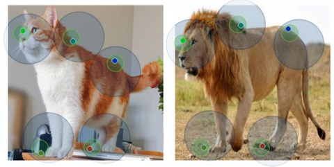</a></td>
<td align="left" width=550>Neural Best-Buddies: Sparse Cross-Domain Correspondence 
<a href="https://kfiraberman.github.io/">Kfir Aberman</a>, 
<a href="https://liaojing.github.io/html/">Jing Liao</a>, 
<a href="https://rubbly.cn/">Mingyi Shi</a>, 
<a href="http://www.cs.huji.ac.il/~danix/">Dani Lischinski</a>, 
<a href="http://www.cs.sdu.edu.cn/~baoquan/">Baoquan Chen</a>, 
<a href="https://www.cs.tau.ac.il/~dcor/">Daniel Cohen-Or</a> 
In SIGGRAPH 2018 
<a href="https://arxiv.org/abs/1805.04140">[Paper]</a> 
<a href="http://fve.bfa.edu.cn/recap/nbbs/">[Project]</a>
</td></tr></tbody></table>

<table> <tbody> <tr> <td align="left" width=250>
<a href="https://people.csail.mit.edu/jsolomon/assets/curve_fmaps.pdf">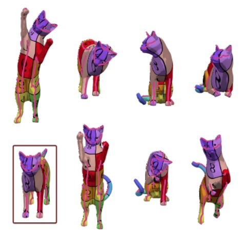</a></td>
<td align="left" width=550>Interactive Curve Constrained Functional Maps 
<a href="https://www.graphics.rwth-aachen.de/person/33/">Anne Gehre</a>, 
<a href="https://www.radcliffe.harvard.edu/people/michael-bronstein">Michael Bronstein</a>, 
<a href="https://www.graphics.rwth-aachen.de/person/3/">Leif Kobbelt</a>, 
<a href="http://people.csail.mit.edu/jsolomon/">Justin Solomon</a> 
In SGP 2018 
<a href="https://people.csail.mit.edu/jsolomon/assets/curve_fmaps.pdf">[Paper]</a> 
</td></tr></tbody></table>

<table> <tbody> <tr> <td align="left" width=250>
</td>
<td align="left" width=550>Adversarial Examples that Fool both Computer Vision and Time-Limited Humans 
<a href="https://ai.google/research/people/GamaleldinFathyElsayed">Gamaleldin F. Elsayed</a>, 
<a href="shreya-shankar.com">Shreya Shankar</a>, 
<a href="https://scholar.google.com/citations?user=7N-ethYAAAAJ&hl=en">Brian Cheung</a>, 
<a href="https://www.papernot.fr/">Nicolas Papernot</a>, 
<a href="https://ai.google/research/people/AlexeyKurakin">Alex Kurakin</a>, 
<a href="https://www.iangoodfellow.com/">Ian Goodfellow</a>, 
<a href="http://www.sohldickstein.com/">Jascha Sohl-Dickstein</a> 
In NeurIPS 2018 
<a href="https://arxiv.org/pdf/1802.08195">[Paper]</a> 
</td></tr></tbody></table>

<table> <tbody> <tr> <td align="left" width=250>
</td>
<td align="left" width=550>A Neural Representation of Sketch Drawings 
<a href="https://research.google.com/pubs/105004.html">David Ha</a>, 
<a href="https://research.google.com/pubs/author39086.html">Douglas Eck</a> 
In ICLR 2018 
<a href="https://arxiv.org/abs/1704.03477">[Paper]</a> 
</td></tr></tbody></table>

<table> <tbody> <tr> <td align="left" width=250>
<a href="https://github.com/brownvc/ganimorph/">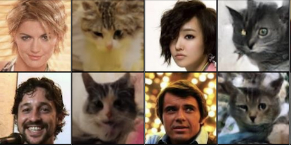</a></td>
<td align="left" width=550>Improving Shape Deformation in Unsupervised Image-to-Image Translation 
<a href="https://skylion007.github.io/">Aaron Gokaslan</a>, 
<a href="http://vivekr.me/">Vivek Ramanujan</a>, 
<a href="https://dritchie.github.io/">Daniel Ritchie</a>, 
<a href="https://researchportal.bath.ac.uk/en/persons/kwang-in-kim/">Kwang In Kim</a>, 
<a href="http://jamestompkin.com/">James Tompkin</a> 
In ECCV 2018 
<a href="https://arxiv.org/pdf/1808.04325.pdf">[Paper]</a> 
<a href="https://github.com/brownvc/ganimorph/">[Project]</a>
</td></tr></tbody></table>

<table> <tbody> <tr> <td align="left" width=250>
<a href="https://github.com/NVlabs/MUNIT">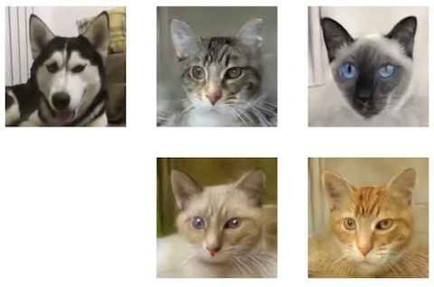</a></td>
<td align="left" width=550>Multimodal UNsupervised Image-to-image Translation 
<a href="http://www.cs.cornell.edu/~xhuang/">Xun Huang</a>, 
<a href="http://mingyuliu.net/">Ming-Yu Liu</a>, 
<a href="https://vision.cornell.edu/se3/people/serge-belongie/">Serge Belongie</a>, 
<a href="http://jankautz.com/">Jan Kautz</a> 
In ECCV 2018 
<a href="https://arxiv.org/pdf/1804.04732.pdf">[Paper]</a> 
<a href="https://github.com/NVlabs/MUNIT">[Project]</a>
</td></tr></tbody></table>

<table> <tbody> <tr> <td align="left" width=250>
<a href="https://ps.is.tuebingen.mpg.de/publications/zuffi-cvpr-2018">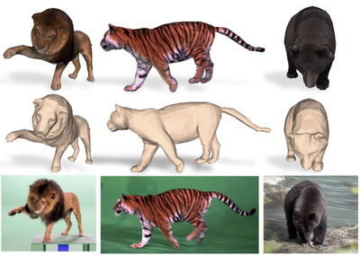</a></td>
<td align="left" width=550>Lions and Tigers and Bears: Capturing Non-Rigid 3D Articulated Shape from Images 
<a href="https://ps.is.tuebingen.mpg.de/person/szuffi">Silvia Zuffi</a>, 
<a href="https://people.eecs.berkeley.edu/~kanazawa/">Angjoo Kanazawa</a>, 
<a href="https://ps.is.mpg.de/~black">Michael J. Black</a> 
In CVPR 2018 
<a href="http://files.is.tue.mpg.de/black/papers/zuffiCVPR2018.pdf">[Paper]</a> 
<a href="https://ps.is.tuebingen.mpg.de/publications/zuffi-cvpr-2018">[Project]</a>
</td></tr></tbody></table>

<table> <tbody> <tr> <td align="left" width=250>
<a href="https://people.eecs.berkeley.edu/~lingqi/publications/paper_fur2.pdf">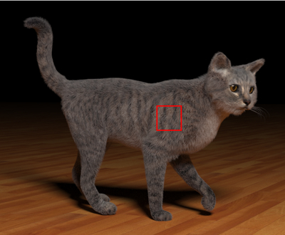</a></td>
<td align="left" width=550>An Efficient and Practical Near and Far Field Fur Reflectance Model 
<a href="https://people.eecs.berkeley.edu/~lingqi/">Ling-Qi Yan</a>, 
<a href="graphics.ucsd.edu/~henrik/">Henrik Wann Jensen</a>, 
<a href="http://cseweb.ucsd.edu/~ravir/">Ravi Ramamoorthi</a> 
In SIGGRAPH 2017 
<a href="https://people.eecs.berkeley.edu/~lingqi/publications/paper_fur2.pdf">[Paper]</a> 
</td></tr></tbody></table>

<table> <tbody> <tr> <td align="left" width=250>
<a href="http://cseweb.ucsd.edu/~viscomp/projects/LF/papers/SIG17/lfv/">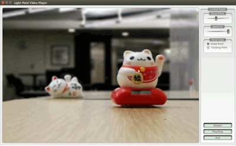</a></td>
<td align="left" width=550>Light Field Video Capture Using a Learning-Based Hybrid Imaging System 
<a href="https://people.eecs.berkeley.edu/~tcwang0509/">Ting-Chun Wang</a>, 
<a href="https://www.cs.cmu.edu/~junyanz/">Jun-Yan Zhu</a>, 
<a href="http://nkhademi.com/">Nima Khademi Kalantari</a>, 
<a href="https://people.eecs.berkeley.edu/~efros/">Alexei A. Efros</a>, 
<a href="http://cseweb.ucsd.edu/~ravir/">Ravi Ramamoorthi</a> 
In SIGGRAPH 2017 
<a href="https://arxiv.org/abs/1705.02997">[Paper]</a> 
<a href="http://cseweb.ucsd.edu/~viscomp/projects/LF/papers/SIG17/lfv/">[Project]</a>
</td></tr></tbody></table>

<table> <tbody> <tr> <td align="left" width=250>
<a href="https://github.com/mingyuliutw/UNIT">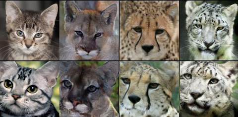</a></td>
<td align="left" width=550>Unsupervised Image-to-Image Translation Networks 
<a href="http://mingyuliu.net/">Ming-Yu Liu</a>, 
<a href="http://www.iupr.com/tmb">Thomas Breuel</a>, 
<a href="http://jankautz.com/">Jan Kautz</a> 
In NIPS 2017 
<a href="https://arxiv.org/pdf/1703.00848.pdf">[Paper]</a> 
<a href="https://github.com/mingyuliutw/UNIT">[Project]</a>
</td></tr></tbody></table>

<table> <tbody> <tr> <td align="left" width=250>
<a href="https://junyanz.github.io/CycleGAN/">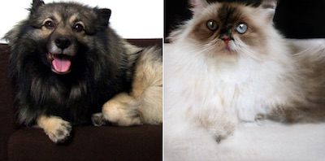</a></td>
<td align="left" width=550>Unpaired Image-to-Image Translation using Cycle-Consistent Adversarial Networks 
<a href="http://www.cs.cmu.edu/~junyanz/">Jun-Yan Zhu*</a>, 
<a href="https://taesung.me/">Taesung Park*</a>, 
<a href="http://people.eecs.berkeley.edu/~isola/">Phillip Isola</a>, 
<a href="https://people.eecs.berkeley.edu/~efros/">Alexei A. Efros</a> 
In ICCV 2017 
<a href="https://arxiv.org/abs/1703.10593">[Paper]</a> 
<a href="https://junyanz.github.io/CycleGAN/">[Project]</a>
</td></tr></tbody></table>

<table> <tbody> <tr> <td align="left" width=250>
<a href="https://arxiv.org/abs/1705.02193">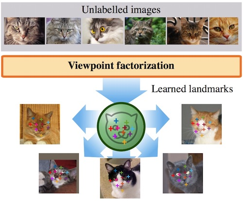</a></td>
<td align="left" width=550>Unsupervised learning of object landmarks by factorized spatial embeddings 
<a href="http://www.robots.ox.ac.uk/~jdt/">James Thewlis</a>, 
<a href="http://homepages.inf.ed.ac.uk/hbilen/">Hakan Bilen</a>, 
<a href="http://www.robots.ox.ac.uk/~vedaldi/">Andrea Vedaldi</a> 
In ICCV 2017 
<a href="https://arxiv.org/abs/1705.02193">[Paper]</a> 
</td></tr></tbody></table>

<table> <tbody> <tr> <td align="left" width=250>
</td>
<td align="left" width=550>Image-to-Image Translation with Conditional Adversarial Networks 
<a href="https://github.com/phillipi">Phillip Isola</a>, 
<a href="https://www.cs.cmu.edu/~junyanz/">Jun-Yan Zhu</a>, 
<a href="https://people.eecs.berkeley.edu/~tinghuiz/">Tinghui Zhou</a>, 
<a href="https://people.eecs.berkeley.edu/~efros/">Alexei A. Efros</a> 
In CVPR 2017 
<a href="https://arxiv.org/abs/1611.07004">[Paper]</a> 
<a href="https://github.com/phillipi/pix2pix">[Project]</a>
</td></tr></tbody></table>

<table> <tbody> <tr> <td align="left" width=250>
<a href="https://arxiv.org/abs/1612.06370">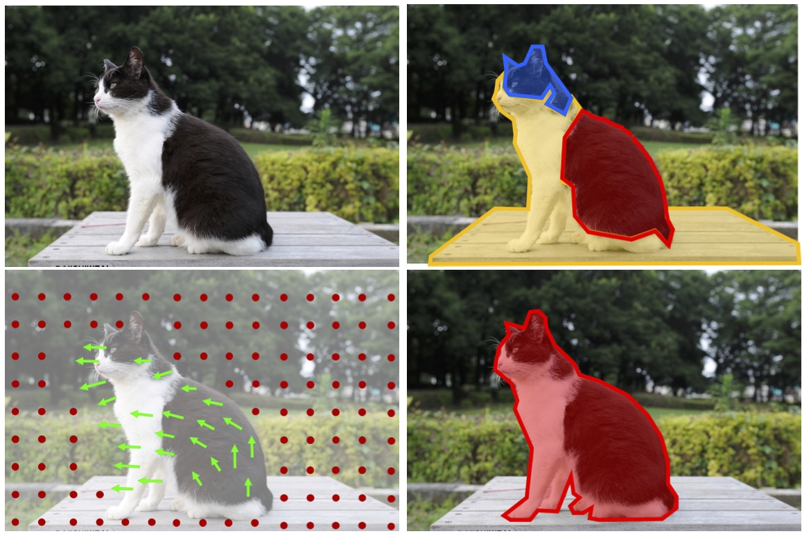</a></td>
<td align="left" width=550>Learning Features by Watching Objects Move 
<a href="https://people.eecs.berkeley.edu/~pathak/">Deepak Pathak</a>, 
<a href="http://www.rossgirshick.info/">Ross Girshick</a>, 
<a href="https://pdollar.github.io/">Piotr Dollar</a>, 
<a href="https://people.eecs.berkeley.edu/~trevor/">Trevor Darrell</a>, 
<a href="http://home.bharathh.info/">Bharath Hariharan</a> 
In CVPR 2017 
<a href="https://arxiv.org/abs/1612.06370">[Paper]</a> 
</td></tr></tbody></table>

<table> <tbody> <tr> <td align="left" width=250>
<a href="https://jeremywrnr.com/project/codepilot/">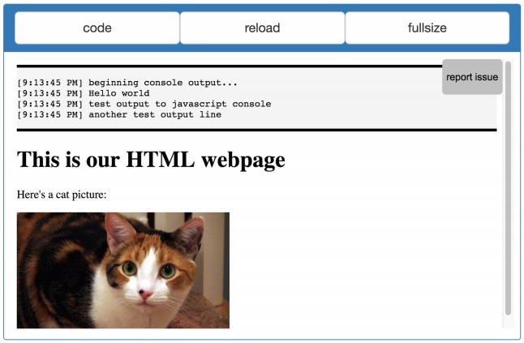</a></td>
<td align="left" width=550>CodePilot: Scaffolding End-to-End Collaborative Software Development for Novice Programmers 
<a href="https://jeremywrnr.com/">Jeremy Warner</a>, 
<a href="http://www.pgbovine.net/index.html">Philip J. Guo</a> 
In CHI 2017 
<a href="http://www.pgbovine.net/publications/CodePilot-collaborative-programming-IDE_CHI-2017.pdf">[Paper]</a> 
<a href="https://jeremywrnr.com/project/codepilot/">[Project]</a>
</td></tr></tbody></table>

<table> <tbody> <tr> <td align="left" width=250>
<a href="https://joe.cat/CHI-revolt/">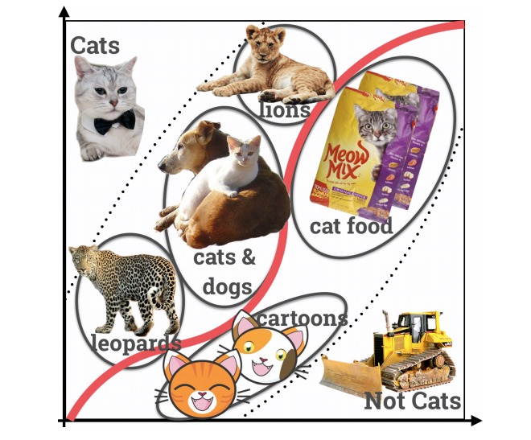</a></td>
<td align="left" width=550>Revolt: Collaborative Crowdsourcing for Labeling Machine Learning Datasets 
<a href="https://joe.cat/">Joseph Chee Chang</a>, 
<a href="http://saleemaamershi.com/">Saleema Amershi</a>, 
<a href="https://www.ecekamar.com/">Ece Kamar</a> 
In CHI 2017 
<a href="https://joe.cat/images/papers/revolt-crowd-labeling.pdf">[Paper]</a> 
<a href="https://joe.cat/CHI-revolt/">[Project]</a>
</td></tr></tbody></table>

<table> <tbody> <tr> <td align="left" width=250>
<a href="https://www.graphics.rwth-aachen.de/media/papers/Campen2016_SimplicialFoliations.pdf">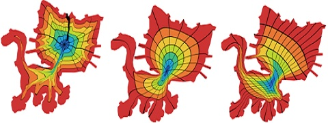</a></td>
<td align="left" width=550>Bijective Maps from Simplicial Foliations 
<a href="https://www.graphics.rwth-aachen.de/person/7/">Marcel Campen</a>, 
<a href="http://vgc.poly.edu/~csilva/">Claudio T. Silva</a>, 
<a href="http://mrl.nyu.edu/~dzorin/">Denis Zorin</a> 
In SIGGRAPH 2016 
<a href="https://www.graphics.rwth-aachen.de/media/papers/Campen2016_SimplicialFoliations.pdf">[Paper]</a> 
</td></tr></tbody></table>

<table> <tbody> <tr> <td align="left" width=250>
<a href="http://irc.cs.sdu.edu.cn/CFS/">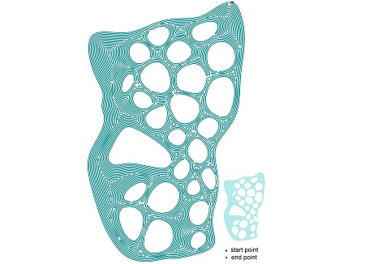</a></td>
<td align="left" width=550>Connected Fermat Spirals for Layered Fabrication 
<a href="http://irc.cs.sdu.edu.cn/~zhaohaisen/">Haisen Zhao</a>, 
Fanglin Gu, 
<a href="https://www.cs.utexas.edu/~huangqx/">Qixing Huang</a>, 
J. A. Garcia Galicia, 
<a href="http://www-bcf.usc.edu/~yongchen/">Yong Chen</a>, 
<a href="http://www.cs.sdu.edu.cn/zh/~chtu">Changhe Tu</a>, 
<a href="http://hpcg.purdue.edu/bbenes/index.htm">Bedrich Benes</a>, 
<a href="http://www.cs.sfu.ca/~haoz/">Hao Zhang</a>, 
<a href="http://www.cs.tau.ac.il/~dcor/">Daniel Cohen-Or</a>, 
<a href="http://www.cs.sdu.edu.cn/~baoquan/">Baoquan Chen</a> 
In SIGGRAPH 2016 
<a href="http://irc.cs.sdu.edu.cn/~zhaohaisen/paper/fermat_spirals.pdf">[Paper]</a> 
<a href="http://irc.cs.sdu.edu.cn/CFS/">[Project]</a>
</td></tr></tbody></table>

<table> <tbody> <tr> <td align="left" width=250>
<a href="https://github.com/akanazawa/catdeform">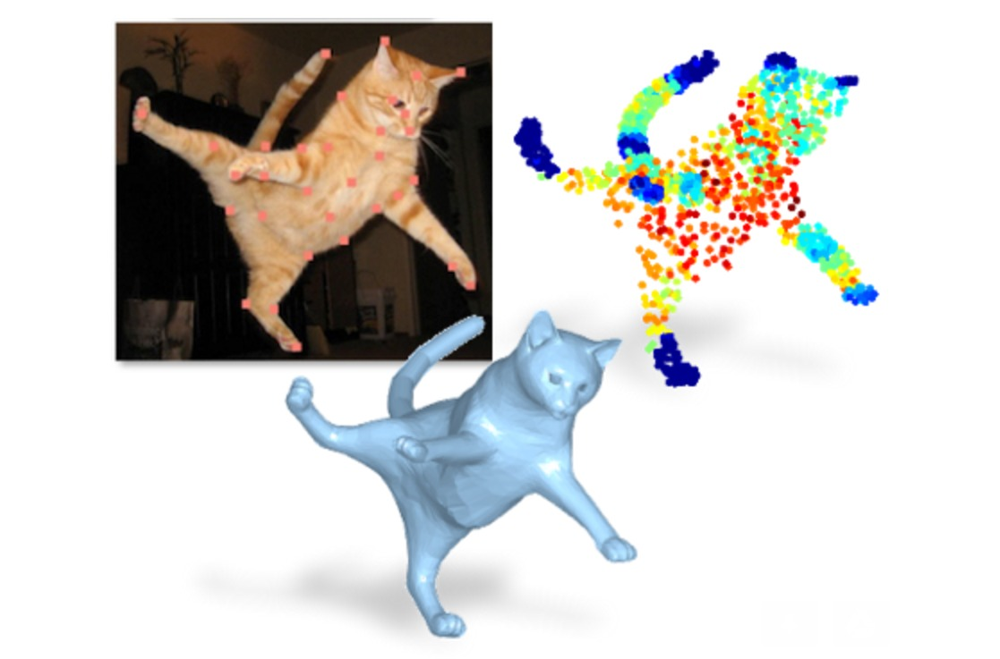</a></td>
<td align="left" width=550>Learning 3D Deformation of Animals from 2D Images 
<a href="http://www.umiacs.umd.edu/~kanazawa/">Angjoo Kanazawa</a>, 
<a href="https://services.math.duke.edu/~shaharko/">Shahar Kovalsky</a>, 
<a href="http://www.wisdom.weizmann.ac.il/~/ronen/">Ronen Basri</a>, 
<a href="https://www.cs.umd.edu/~djacobs/">David W. Jacobs</a> 
In Eurographics 2016 
<a href="https://arxiv.org/abs/1507.07646">[Paper]</a> 
<a href="https://github.com/akanazawa/catdeform">[Project]</a>
</td></tr></tbody></table>

<table> <tbody> <tr> <td align="left" width=250>
<a href="https://arxiv.org/pdf/1608.04366.pdf">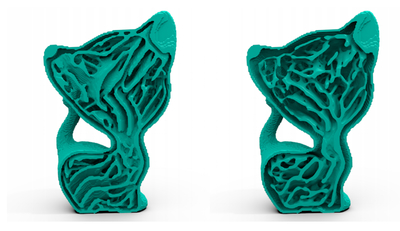</a></td>
<td align="left" width=550>Infill Optimization for Additive Manufacturing--Approaching Bone-like Porous Structures 
<a href="https://wwwcg.in.tum.de/group/persons/wu.html">Jun Wu</a>, 
<a href="http://www.dtu.dk/english/service/phonebook/person?id=18078&tab=2&qt=dtupublicationquery">Niels Aage</a>, 
<a href="https://wwwcg.in.tum.de/group/persons/westermann.html">R&#252diger Westermann</a>, 
<a href="http://www.dtu.dk/english/service/phonebook/person?id=2278&tab=1">Ole Sigmund</a> 
In Arxiv 2016 
<a href="https://arxiv.org/pdf/1608.04366.pdf">[Paper]</a> 
</td></tr></tbody></table>

<table> <tbody> <tr> <td align="left" width=250>
<a href="http://people.eecs.berkeley.edu/~lingqi/publications/paper_fur.pdf">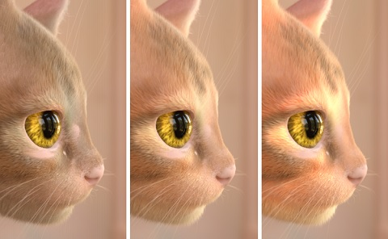</a></td>
<td align="left" width=550>Physically-Accurate Fur Reflectance: Modeling, Measurement and Rendering 
<a href="http://people.eecs.berkeley.edu/~lingqi/">Ling-Qi Yan</a>, 
<a href="http://cseweb.ucsd.edu/~c5tseng/">Chi-Wei Tseng</a>, 
<a href="graphics.ucsd.edu/~henrik/">Henrik Wann Jensen</a>, 
<a href="https://cseweb.ucsd.edu/~ravir/">Ravi Ramamoorthi</a> 
In SIGGRAPH Asia 2015 
<a href="http://people.eecs.berkeley.edu/~lingqi/publications/paper_fur.pdf">[Paper]</a> 
</td></tr></tbody></table>

<table> <tbody> <tr> <td align="left" width=250>
<a href="https://members.loria.fr/JDumas/publications/sfsyn/">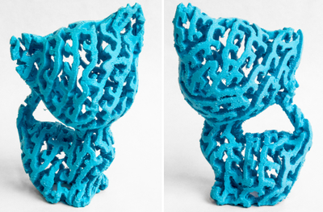</a></td>
<td align="left" width=550>By-Example Synthesis of Structurally Sound Patterns 
<a href="https://members.loria.fr/JDumas/">J&#233r&#233mie Dumas</a>, 
An Lu, 
<a href="http://www.antexel.com/sylefeb/research">Sylvain Lefebvre</a>, 
<a href="https://wwwcg.in.tum.de/group/persons/wu.html">Jun Wu</a>, 
<a href="https://wwwcg.in.tum.de/group/persons/dick.html">Christian Dick</a> 
In SIGGRAPH 2015 
<a href="https://members.loria.fr/JDumas/files/papers/sfsyn/byexsyn.pdf">[Paper]</a> 
<a href="https://members.loria.fr/JDumas/publications/sfsyn/">[Project]</a>
</td></tr></tbody></table>

<table> <tbody> <tr> <td align="left" width=250>
<a href="http://www.cs.columbia.edu/cg/hydrographics/">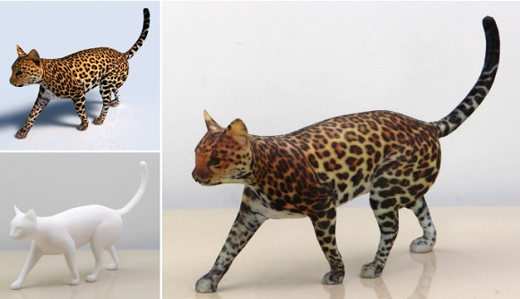</a></td>
<td align="left" width=550>Computational Hydrographic Printing 
Yizhong Zhang, 
Chunji Yin, 
<a href="http://www.cs.columbia.edu/~cxz/">Changxi Zheng</a>, 
<a href="http://www.kunzhou.net/">Kun Zhou</a> 
In SIGGRAPH 2015 
<a href="http://www.cs.columbia.edu/cg/hydrographics/hydrographics.pdf">[Paper]</a> 
<a href="http://www.cs.columbia.edu/cg/hydrographics/">[Project]</a>
</td></tr></tbody></table>

<table> <tbody> <tr> <td align="left" width=250>
</td>
<td align="left" width=550>Convolutional Wasserstein Distances: Efficient Optimal Transportation on Geometric Domains 
<a href="http://people.csail.mit.edu/jsolomon/">Justin Solomon</a>, 
<a href="http://fernandodegoes.org/">Fernando de Goes</a>, 
<a href="http://gpeyre.github.io/"> Gabriel Peyre</a>, 
<a href="http://www.iip.ist.i.kyoto-u.ac.jp/member/cuturi/">Marco Cuturi</a>, 
<a href="http://autodeskresearch.com/people/adrianbutscher">Adrian Butscher</a>, 
Andy Nguyen, 
Tao Du, 
<a href="http://geometry.stanford.edu/member/guibas/">Leonidas Guibas</a> 
In SIGGRAPH 2015 
<a href="http://people.csail.mit.edu/jsolomon/assets/convolutional_w2.compressed.pdf">[Paper]</a> 
</td></tr></tbody></table>

<table> <tbody> <tr> <td align="left" width=250>
<a href="http://wwwcg.in.tum.de/research/research/publications/2015/high-resolution-topology-optimization.html">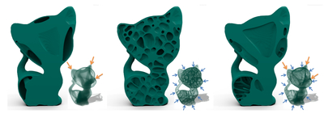</a></td>
<td align="left" width=550>A System for High-Resolution Topology Optimization 
<a href="https://wwwcg.in.tum.de/group/persons/wu.html">Jun Wu</a>, 
<a href="https://wwwcg.in.tum.de/group/persons/dick.html">Christian Dick</a>, 
<a href="https://wwwcg.in.tum.de/group/persons/westermann.html">R&#252diger Westermann</a> 
In IEEE Transactions on Visualization and Computer Graphics 2015 
<a href="http://wwwcg.in.tum.de/fileadmin/user_upload/Lehrstuehle/Lehrstuhl_XV/Research/Publications/2015/TopOpt/preprint.pdf">[Paper]</a> 
<a href="http://wwwcg.in.tum.de/research/research/publications/2015/high-resolution-topology-optimization.html">[Project]</a>
</td></tr></tbody></table>

<table> <tbody> <tr> <td align="left" width=250>
</td>
<td align="left" width=550>Unsupervised Visual Representation Learning by Context Prediction 
<a href="http://www.cs.cmu.edu/~cdoersch/">Carl Doersch</a>, 
<a href="http://www.cs.cmu.edu/~abhinavg/">Abhinav Gupta</a>, 
<a href="http://www.eecs.berkeley.edu/~efros/">Alexei A. Efros</a> 
In ICCV 2015 
<a href="http://arxiv.org/pdf/1505.05192v2">[Paper]</a> 
<a href="http://graphics.cs.cmu.edu/projects/deepContext/">[Project]</a>
</td></tr></tbody></table>

<table> <tbody> <tr> <td align="left" width=250>
</td>
<td align="left" width=550>Fully Convolutional Networks for Semantic Segmentation 
<a href="http://people.eecs.berkeley.edu/~jonlong/">Jon Long</a>, 
<a href="http://imaginarynumber.net/">Evan Shelhamer</a>, 
<a href="http://people.eecs.berkeley.edu/~trevor/">Trevor Darrell</a> 
In CVPR 2015 
<a href="http://people.eecs.berkeley.edu/~jonlong/long_shelhamer_fcn.pdf">[Paper]</a> 
</td></tr></tbody></table>

<table> <tbody> <tr> <td align="left" width=250>
<a href="http://visual.cs.ucl.ac.uk/pubs/ccca/">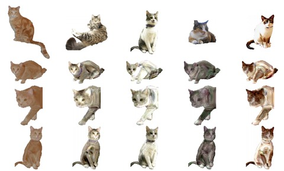</a></td>
<td align="left" width=550>Modeling Object Appearance using Context-Conditioned Component Analysis 
<a href="http://www.cs.ucl.ac.uk/staff/dturmukh/">Daniyar Turmukhambetov</a>, 
<a href="http://cs.bath.ac.uk/~nc537/">Neill D.F. Campbell</a>, 
<a href="http://www.cs.ucl.ac.uk/staff/s.prince/">Simon J.D. Prince</a>, 
<a href="http://www.cs.ucl.ac.uk/staff/s.prince/">Jan Kautz</a> 
In CVPR 2015 
<a href="https://www.cv-foundation.org/openaccess/content_cvpr_2015/papers/Turmukhambetov_Modeling_Object_Appearance_2015_CVPR_paper.pdf">[Paper]</a> 
<a href="http://visual.cs.ucl.ac.uk/pubs/ccca/">[Project]</a>
</td></tr></tbody></table>

<table> <tbody> <tr> <td align="left" width=250>
<a href="http://arturodeza.github.io/virality/">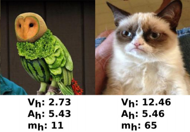</a></td>
<td align="left" width=550>Understanding Image Virality 
<a href="http://arturodeza.wikidot.com/">Arturo Deza</a>, 
<a href="https://filebox.ece.vt.edu/~parikh/">Devi Parikh</a> 
In CVPR 2015 
<a href="https://arxiv.org/abs/1503.02318">[Paper]</a> 
<a href="http://arturodeza.github.io/virality/">[Project]</a>
</td></tr></tbody></table>

<table> <tbody> <tr> <td align="left" width=250>
<a href="https://sites.google.com/site/marcolivesu/quadlayouts">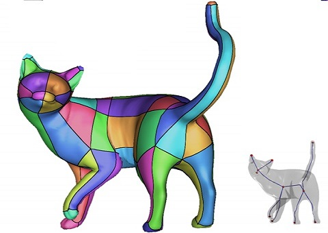</a></td>
<td align="left" width=550>Extraction of the Quad Layout of a Triangle Mesh Guided by its Curve-Skeleton 
<a href="http://francescousai.info/">Francesco Usai</a>, 
<a href="https://sites.google.com/site/marcolivesu/">Marco Livesu</a>, 
<a href="http://www.disi.unige.it/person/PuppoE/">Enrico Puppo</a>, 
<a href="http://vcg.isti.cnr.it/~tarini/">Marco Tarini</a>, 
<a href="http://ugo.sc.unica.it/">Riccardo Scateni</a> 
In ACM Transactions on Graphics (TOG) 2015 
<a href="https://drive.google.com/open?id=0B6EEjMMaU7haZG9hVVpxSjd2dEE">[Paper]</a> 
<a href="https://sites.google.com/site/marcolivesu/quadlayouts">[Project]</a>
</td></tr></tbody></table>

<table> <tbody> <tr> <td align="left" width=250>
</td>
<td align="left" width=550>Automating Image Morphing using Structural Similarity on a Halfway Domain 
Jing Liao, 
<a href="http://www.rodlima.net/">Rodolfo Lima</a>, 
<a href="http://w3.impa.br/~diego/">Diego Nehab</a>, 
<a href="http://research.microsoft.com/en-us/um/people/hoppe/">Hugues Hoppe</a>, 
<a href="http://www.cse.ust.hk/~psander/">Pedro Sander</a>, 
<a href="http://www.cad.zju.edu.cn/home/jhyu/English.htm">Jinhui Yu</a> 
In SIGGRAPH 2014 
<a href="http://www.cs.ust.hk/~psander/docs/pixmorph.pdf">[Paper]</a> 
<a href="http://research.microsoft.com/en-us/um/people/hoppe/proj/morph/">[Project]</a>
</td></tr></tbody></table>

<table> <tbody> <tr> <td align="left" width=250>
<a href="https://www.cs.cmu.edu/~junyanz/projects/averageExplorer/index.html">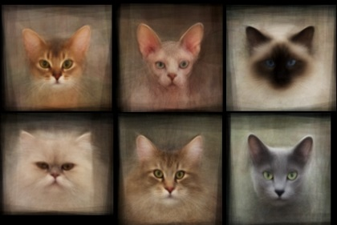</a></td>
<td align="left" width=550>AverageExplorer: Interactive Exploration and Alignment of Visual Data Collections 
<a href="https://www.cs.cmu.edu/~junyanz">Jun-Yan Zhu</a>, 
<a href="http://www.cs.ucdavis.edu/~yjlee/">Yong Jae Lee</a>, 
<a href="http://www.eecs.berkeley.edu/~efros/">Alexei A. Efros</a> 
In SIGGRAPH 2014 
<a href="https://www.cs.cmu.edu/~junyanz/projects/averageExplorer/averageExplorer.pdf">[Paper]</a> 
<a href="https://www.cs.cmu.edu/~junyanz/projects/averageExplorer/index.html">[Project]</a>
</td></tr></tbody></table>

<table> <tbody> <tr> <td align="left" width=250>
<a href="https://sites.google.com/site/build2last43dp/">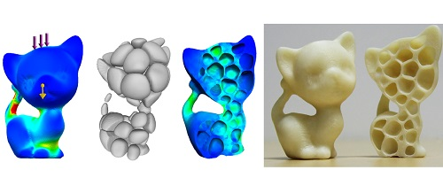</a></td>
<td align="left" width=550>Build-to-Last: Strength to Weight 3D Printed Objects 
<a href="http://vr.sdu.edu.cn/~lulin/">Lin Lu</a>, 
<a href="http://www.cs.bgu.ac.il/~asharf/">Andrei Sharf</a>, 
<a href="http://irc.cs.sdu.edu.cn/~zhaohaisen/">Haisen Zhao</a>, 
Yuan Wei, 
Qingnan Fan, 
Xuelin Chen, 
<a href="http://www.animlife.com/">Yann Savoye</a>, 
<a href="http://www.cs.sdu.edu.cn/zh/60">Changhe Tu</a>, 
<a href="http://www.cs.tau.ac.il/~dcor/">Daniel Cohen-Or</a>, 
<a href="http://www.cs.sdu.edu.cn/~baoquan/">Baoquan Chen</a> 
In SIGGRAPH 2014 
<a href="https://www.cs.tau.ac.il/~dcor/articles/2014/Build-to-Last.pdf">[Paper]</a> 
<a href="https://sites.google.com/site/build2last43dp/">[Project]</a>
</td></tr></tbody></table>

<table> <tbody> <tr> <td align="left" width=250>
<a href="https://sites.google.com/site/jbhuang0604/publications/struct_completion">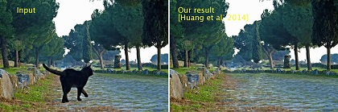</a></td>
<td align="left" width=550>Image Completion using Planar Structure Guidance 
<a href="https://sites.google.com/site/jbhuang0604/">Jia-Bin Huang</a>, 
<a href="http://research.microsoft.com/en-us/people/sbkang/">Sing Bing Kang</a>, 
<a href="http://www.ece.illinois.edu/directory/profile.asp?n-ahuja">Narendra Ahuja</a>, 
<a href="http://johanneskopf.de/">Johannes Kopf</a> 
In SIGGRAPH 2014 
<a href="https://www.box.com/shared/static/x3zb7p2qp696dxu3wf34.pdf">[Paper]</a> 
<a href="https://sites.google.com/site/jbhuang0604/publications/struct_completion">[Project]</a>
</td></tr></tbody></table>

<table> <tbody> <tr> <td align="left" width=250>
</td>
<td align="left" width=550>Robust and Accurate Skeletal Rigging from Mesh Sequences 
<a href="http://graphics.cs.uh.edu/ble/about.php">Binh Huy Le</a>, 
<a href="http://graphics.cs.uh.edu/zdeng/">Zhigang Deng</a> 
In SIGGRAPH 2014 
<a href="http://graphics.cs.uh.edu/ble/papers/2014s-ske/skeleton-draft.pdf">[Paper]</a> 
<a href="http://graphics.cs.uh.edu/ble/papers/2014s-ske/">[Project]</a>
</td></tr></tbody></table>

<table> <tbody> <tr> <td align="left" width=250>
</td>
<td align="left" width=550>Context as Supervisory Signal: Discovering Objects with Predictable Context 
<a href="http://www.cs.cmu.edu/~cdoersch/">Carl Doersch</a>, 
<a href="http://www.cs.cmu.edu/~abhinavg/">Abhinav Gupta</a>, 
<a href="http://www.eecs.berkeley.edu/~efros/">Alexei A. Efros</a> 
In ECCV 2014 
<a href="http://graphics.cs.cmu.edu/projects/contextPrediction/contextPrediction.pdf">[Paper]</a> 
<a href="http://graphics.cs.cmu.edu/projects/contextPrediction/">[Project]</a>
</td></tr></tbody></table>

<table> <tbody> <tr> <td align="left" width=250>
</td>
<td align="left" width=550>Halftone QR Codes 
<a href="http://cgv.cs.nthu.edu.tw/hkchu">Hung-Kuo Chu</a>, 
Chia-Sheng Chang, 
<a href="http://www.cs.nthu.edu.tw/~rrlee/rrlee/Home.html">Ruen-Rone Lee</a>, 
<a href="http://www0.cs.ucl.ac.uk/staff/n.mitra/">Niloy J. Mitra</a> 
In SIGGRAPH Asia 2013 
<a href="http://vecg.cs.ucl.ac.uk/Projects/SmartGeometry/halftone_QR/paper_docs/halftoneQR_sigga13.pdf">[Paper]</a> 
<a href="http://vecg.cs.ucl.ac.uk/Projects/SmartGeometry/halftone_QR/halftoneQR_sigga13.html">[Project]</a>
</td></tr></tbody></table>

<table> <tbody> <tr> <td align="left" width=250>
<a href="https://graphics.ethz.ch/publications/papers/paperLuk13.php">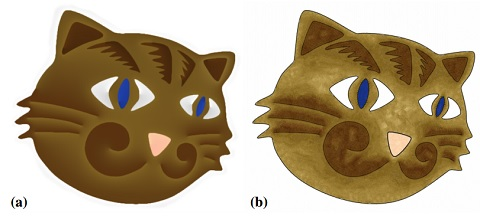</a></td>
<td align="left" width=550>Painting by feature: texture boundaries for example-based image creation 
<a href="http://dcgi.fel.cvut.cz/people/lukacmi1">Michal Lukac</a>, 
<a href="http://dcgi.fel.cvut.cz/people/fiserja9">Jakub Fiser</a>, 
<a href="https://graphics.ethz.ch/~jebazin/">Jean-Charles Bazin</a>, 
<a href="http://dcgi.fel.cvut.cz/people/jamriond">Ondrej Jamriska</a>, 
<a href="http://www.ahornung.net/">Alexander Sorkine-Hornung</a>, 
<a href="http://dcgi.felk.cvut.cz/home/sykorad/">Daniel Sykora</a> 
In SIGGRAPH 2013 
<a href="https://s3-us-west-1.amazonaws.com/disneyresearch/wp-content/uploads/20150324052134/Painting-by-Feature-Paper.pdf">[Paper]</a> 
<a href="https://graphics.ethz.ch/publications/papers/paperLuk13.php">[Project]</a>
</td></tr></tbody></table>

<table> <tbody> <tr> <td align="left" width=250>
</td>
<td align="left" width=550>Robust Inside-Outside Segmentation using Generalized Winding Numbers 
<a href="http://www.cs.columbia.edu/~jacobson/">Alec Jacobson</a>, 
<a href="http://www.seas.upenn.edu/~ladislav/">Ladislav Kavan</a>, 
<a href="http://igl.ethz.ch/people/sorkine/">Olga Sorkine-Hornung</a> 
In SIGGRAPH 2013 
<a href="http://igl.ethz.ch/projects/winding-number/robust-inside-outside-segmentation-using-generalized-winding-numbers-siggraph-2013-jacobson-et-al.pdf">[Paper]</a> 
<a href="http://igl.ethz.ch/projects/winding-number">[Project]</a>
</td></tr></tbody></table>

<table> <tbody> <tr> <td align="left" width=250>
</td>
<td align="left" width=550>Cat Basis Purrsuit 
<a href="http://dimatura.net/">Daniel Caturana</a>, 
<a href="http://www.cs.cmu.edu/~dfouhey/">David Furry</a> 
In SIGBOVIK 2013 
<a href="http://www.oneweirdkerneltrick.com/catbasis.pdf">[Paper]</a> 
</td></tr></tbody></table>

<table> <tbody> <tr> <td align="left" width=250>
<a href="http://www.cs.berkeley.edu/~barron/KarschCVPR2013.pdf">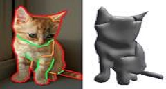</a></td>
<td align="left" width=550>Boundary Cues for 3D Object Shape Recovery 
<a href="http://kevinkarsch.com/">Kevin Karsch</a>, 
<a href="http://web.engr.illinois.edu/~liao17/">Zicheng Liao</a>, 
Jason Rock, 
<a href="http://www.cs.berkeley.edu/~barron/">Jonathan T. Barron</a>, 
<a href="http://web.engr.illinois.edu/~dhoiem/">Derek Hoiem</a> 
In CVPR 2013 
<a href="http://www.cs.berkeley.edu/~barron/KarschCVPR2013.pdf">[Paper]</a> 
</td></tr></tbody></table>

<table> <tbody> <tr> <td align="left" width=250>
<a href="http://vecg.cs.ucl.ac.uk/Projects/SmartGeometry/nr_mesh/nrMesh_tog.html">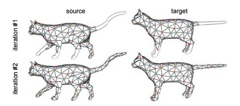</a></td>
<td align="left" width=550>Near-Regular Structure Discovery Using Linear Programming 
<a href="http://ttic.uchicago.edu/~huangqx/">Qixing Huang</a>, 
<a href="http://geometry.stanford.edu/member/guibas/">Leonidas Guibas</a>, 
<a href="http://www0.cs.ucl.ac.uk/staff/n.mitra/">Niloy J. Mitra</a> 
In ACM Transactions on Graphics 2013 
<a href="http://vecg.cs.ucl.ac.uk/Projects/SmartGeometry/nr_mesh/paper_docs/nrMesh_tog.pdf">[Paper]</a> 
<a href="http://vecg.cs.ucl.ac.uk/Projects/SmartGeometry/nr_mesh/nrMesh_tog.html">[Project]</a>
</td></tr></tbody></table>

<table> <tbody> <tr> <td align="left" width=250>
</td>
<td align="left" width=550>A Vectorial Solver for Free-form Vector Gradients 
<a href="http://manao.inria.fr/team/boye/">Simon Boye</a>, 
<a href="http://www.labri.fr/perso/barla/blog/">Pascal Barla</a>, 
<a href="http://www.labri.fr/perso/guenneba/">Gael Guennebaud</a> 
In SIGGRAPH Asia 2012 
<a href="https://hal.archives-ouvertes.fr/hal-00732992/PDF/vs4vg_2012.pdf">[Paper]</a> 
<a href="https://hal.inria.fr/hal-00732992">[Project]</a>
</td></tr></tbody></table>

<table> <tbody> <tr> <td align="left" width=250>
</td>
<td align="left" width=550>Manifold Preserving Edit Propagation 
<a href="http://arts.buaa.edu.cn/staff/chen/index.htm">Xiaowu Chen</a>, 
Dongqing Zou, 
Qinping Zhao, 
<a href="http://www.cs.sfu.ca/~pingtan/">Ping Tan</a> 
In SIGGRAPH Asia 2012 
<a href="http://www.cs.sfu.ca/~pingtan/Papers/sigasia12.pdf">[Paper]</a> 
</td></tr></tbody></table>

<table> <tbody> <tr> <td align="left" width=250>
</td>
<td align="left" width=550>Functional Maps: A Flexible Representation of Maps Between Shapes 
<a href="http://www.lix.polytechnique.fr/~maks/">Maks Ovsjanikov</a>, 
<a href="http://mirela.net.technion.ac.il/">Mirela Ben-Chen</a>, 
<a href="http://people.csail.mit.edu/jsolomon/">Justin Solomon</a>, 
<a href="https://autodeskresearch.com/people/adrian-butscher">Adrian Butscher</a>, 
<a href="http://geometry.stanford.edu/member/guibas/">Leonidas Guibas</a> 
In SIGGRAPH 2012 
<a href="http://citeseerx.ist.psu.edu/viewdoc/download?doi=10.1.1.717.3850&rep=rep1&type=pdf">[Paper]</a> 
</td></tr></tbody></table>

<table> <tbody> <tr> <td align="left" width=250>
</td>
<td align="left" width=550>Building High-level Features Using Large Scale Unsupervised Learning 
<a href="http://cs.stanford.edu/~quocle/">Quoc Le</a>, 
<a href="http://www.cs.toronto.edu/~ranzato/">MarcAurelio Ranzato</a>, 
<a href="http://research.google.com/pubs/RajatMonga.html">Rajat Monga</a>, 
Matthieu Devin, 
Kai Chen, 
<a href="http://research.google.com/pubs/GregCorrado.html">Greg Corrado</a>, 
<a href="http://research.google.com/people/jeff/">Jeff Dean</a>, 
<a href="http://cs.stanford.edu/people/ang/">Andrew Ng</a> 
In ICML 2012 
<a href="http://static.googleusercontent.com/media/research.google.com/en/us/archive/unsupervised_icml2012.pdf">[Paper]</a> 
<a href="http://research.google.com/archive/unsupervised_icml2012.html">[Project]</a>
</td></tr></tbody></table>

<table> <tbody> <tr> <td align="left" width=250>
<a href="http://www.robots.ox.ac.uk/~vgg/publications/2012/parkhi12a/">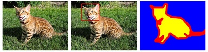</a></td>
<td align="left" width=550>Cats and Dogs 
<a href="http://www.robots.ox.ac.uk/~vgg/publications/index.php?idAuthor=161">Omkar M Parkhi</a>, 
<a href="http://www.robots.ox.ac.uk/~vedaldi/">Andrea Vedaldi</a>, 
<a href="http://www.robots.ox.ac.uk/~az/">Andrew Zisserman</a>, 
<a href="http://www.iiit.ac.in/~jawahar/">C. V. Jawahar</a> 
In CVPR 2012 
<a href="http://www.robots.ox.ac.uk/~vgg/publications/2012/parkhi12a/parkhi12a.pdf">[Paper]</a> 
<a href="http://www.robots.ox.ac.uk/~vgg/publications/2012/parkhi12a/">[Project]</a>
</td></tr></tbody></table>

<table> <tbody> <tr> <td align="left" width=250>
</td>
<td align="left" width=550>Learning to Localize Detected Objects 
<a href="http://web.engr.illinois.edu/~dai9/">Qieyun Dai</a>, 
<a href="http://web.engr.illinois.edu/~dhoiem/">Derek Hoiem</a> 
In CVPR 2012 
<a href="http://web.engr.illinois.edu/~dhoiem/publications/cvpr2012_objectsegmentation_qieyun.pdf">[Paper]</a> 
</td></tr></tbody></table>

<table> <tbody> <tr> <td align="left" width=250>
<a href="http://sweb.cityu.edu.hk/hongbofu/projects/animatedconstructionoflinedrawings_sigga11/#.V3wdKZErI2w">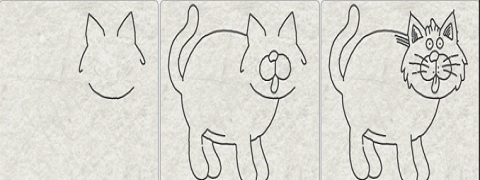</a></td>
<td align="left" width=550>Animated Construction of Line Drawings 
<a href="http://sweb.cityu.edu.hk/hongbofu/">Hongbo Fu</a>, 
<a href="http://sweb.cityu.edu.hk/shizzhou/">Shizhe Zhou</a>, 
<a href="http://staff.ustc.edu.cn/~lgliu/"> Ligang Liu</a>, 
<a href="http://graphics.stanford.edu/~niloy/">Niloy J. Mitra</a> 
In SIGGRAPH Asia 2011 
<a href="http://www.jdl.ac.cn/project/faceId/paperreading/Paper/nyji_20120329_2.pdf">[Paper]</a> 
<a href="http://sweb.cityu.edu.hk/hongbofu/projects/animatedconstructionoflinedrawings_sigga11/#.V3wdKZErI2w">[Project]</a>
</td></tr></tbody></table>

<table> <tbody> <tr> <td align="left" width=250>
<a href="https://www.microsoft.com/en-us/research/publication/nonlinear-revision-control-for-images/">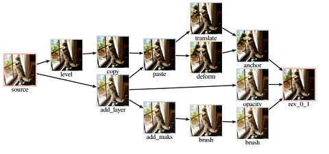</a></td>
<td align="left" width=550>Nonlinear Revision Control for Images 
<a href="http://www.ht-timchen.com/">Hsiang-Ting Chen</a>, 
<a href="http://www.liyiwei.org/">Li-Yi Wei</a>, 
<a href="https://cchang.wordpress.com/\n">Chun-Fa Chang</a> 
In SIGGRAPH  2011 
<a href="http://citeseerx.ist.psu.edu/viewdoc/download?doi=10.1.1.465.986&rep=rep1&type=pdf">[Paper]</a> 
<a href="https://www.microsoft.com/en-us/research/publication/nonlinear-revision-control-for-images/">[Project]</a>
</td></tr></tbody></table>

<table> <tbody> <tr> <td align="left" width=250>
<a href="http://www.cs.princeton.edu/~funk/sig11.pdf">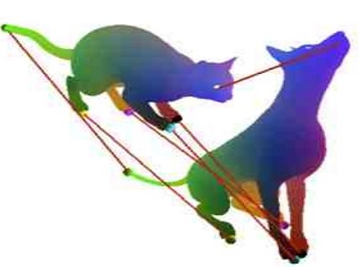</a></td>
<td align="left" width=550>Blended Intrinsic Maps 
<a href="http://vovakim.com/">Vladimir G. Kim</a>, 
<a href="http://www.wisdom.weizmann.ac.il/~ylipman/">Yaron Lipman</a>, 
<a href="http://www.cs.princeton.edu/~funk/"> Thomas Funkhouser</a> 
In SIGGRAPH 2011 
<a href="http://www.cs.princeton.edu/~funk/sig11.pdf">[Paper]</a> 
</td></tr></tbody></table>

<table> <tbody> <tr> <td align="left" width=250>
<a href="http://zurich.disneyresearch.com/OverCoat/">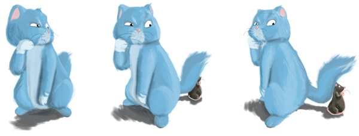</a></td>
<td align="left" width=550>OverCoat: An Implicit Canvas for 3D Painting 
Johannes Schmid, 
Martin Sebastian Senn, 
<a href="https://graphics.ethz.ch/people/grossm/">Markus Gross</a>, 
<a href="https://graphics.ethz.ch/~sumnerb/">Robert W. Sumner</a> 
In SIGGRAPH 2011 
<a href="http://zurich.disneyresearch.com/OverCoat/OverCoat-preprint-s.pdf">[Paper]</a> 
<a href="http://zurich.disneyresearch.com/OverCoat/">[Project]</a>
</td></tr></tbody></table>

<table> <tbody> <tr> <td align="left" width=250>
<a href="http://www.cs.cmu.edu/~kmcrane/Projects/SpinTransformations/">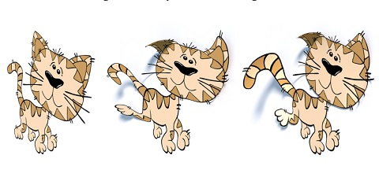</a></td>
<td align="left" width=550>Spin Transformations of Discrete Surfaces 
<a href="http://www.cs.cmu.edu/~kmcrane/">Keenan Crane</a>, 
<a href="http://page.math.tu-berlin.de/~pinkall/">Ulrich Pinkall</a>, 
<a href="http://users.cms.caltech.edu/~ps/">Peter Schroder</a> 
In SIGGRAPH 2011 
<a href="http://www.cs.cmu.edu/~kmcrane/Projects/SpinTransformations/paper.pdf">[Paper]</a> 
<a href="http://www.cs.cmu.edu/~kmcrane/Projects/SpinTransformations/">[Project]</a>
</td></tr></tbody></table>

<table> <tbody> <tr> <td align="left" width=250>
<a href="http://www.robots.ox.ac.uk/~vgg/publications/2011/Parkhi11/">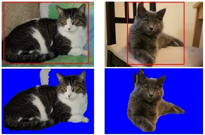</a></td>
<td align="left" width=550>The Truth About Cats and Dogs 
<a href="http://www.robots.ox.ac.uk/~vgg/publications/index.php?idAuthor=161">Omkar M Parkhi</a>, 
<a href="http://www.robots.ox.ac.uk/~vedaldi/">Andrea Vedaldi</a>, 
<a href="http://www.iiit.ac.in/~jawahar/">C. V. Jawahar</a>, 
<a href="http://www.robots.ox.ac.uk/~az/">Andrew Zisserman</a> 
In ICCV 2011 
<a href="http://www.robots.ox.ac.uk/~vgg/publications/2011/Parkhi11/parkhi11.pdf">[Paper]</a> 
<a href="http://www.robots.ox.ac.uk/~vgg/publications/2011/Parkhi11/">[Project]</a>
</td></tr></tbody></table>

<table> <tbody> <tr> <td align="left" width=250>
<a href="http://meekohi.com/Holroyd10/">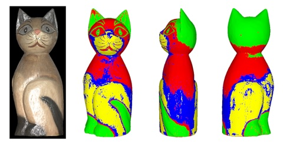</a></td>
<td align="left" width=550>A Coaxial Optical Scanner for Synchronous Acquisition of 3D Geometry and Surface Reflectance 
<a href="http://meekohi.com/">Michael Holroyd</a>, 
<a href="http://www.cs.virginia.edu/~jdl/">Jason Lawrence</a>, 
<a href="http://www.eecs.harvard.edu/~zickler/">Todd Zickler</a> 
In SIGGRAPH 2010 
<a href="http://www.cs.virginia.edu/~mjh7v/papers/Holroyd10.pdf">[Paper]</a> 
<a href="http://meekohi.com/Holroyd10/">[Project]</a>
</td></tr></tbody></table>

<table> <tbody> <tr> <td align="left" width=250>
<a href="http://resources.mpi-inf.mpg.de/ResolutionEnhancement/">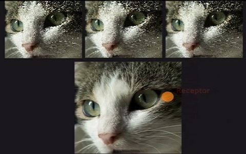</a></td>
<td align="left" width=550>Apparent Display Resolution Enhancement for Moving Images 
<a href="http://people.csail.mit.edu/pdidyk/">Piotr Didyk</a>, 
<a href="http://perso.telecom-paristech.fr/~eisemann/">Elmar Eisemann</a>, 
<a href="http://www.mpi-inf.mpg.de/~ritschel/">Tobias Ritschel</a>, 
<a href="http://www.mpi-inf.mpg.de/~karol/">Karol Myszkowski</a>, 
<a href="http://www.mpi-inf.mpg.de/~hpseidel/">Hans-Peter Seidel</a> 
In SIGGRAPH 2010 
<a href="http://resources.mpi-inf.mpg.de/ResolutionEnhancement/ResolutionEnhancement.pdf">[Paper]</a> 
<a href="http://resources.mpi-inf.mpg.de/ResolutionEnhancement/">[Project]</a>
</td></tr></tbody></table>

<table> <tbody> <tr> <td align="left" width=250>
<a href="http://www.gmrv.es/Publications/2010/SPO10/">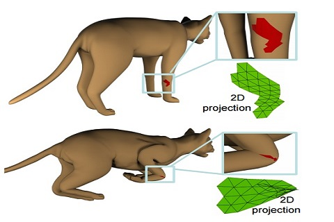</a></td>
<td align="left" width=550>Star-Contours for Efficient Hierarchical Self-Collision Detection 
<a href="http://www.gmrv.es/~sschvartzman">Sara C. Schvartzman</a>, 
<a href="http://www.gmrv.es/~aperez/">Alvaro G. Perez</a>, 
<a href="http://www.gmrv.es/~motaduy">Miguel A. Otaduy</a> 
In SIGGRAPH 2010 
<a href="http://www.gmrv.es/Publications/2010/SPO10/SCTT.pdf">[Paper]</a> 
<a href="http://www.gmrv.es/Publications/2010/SPO10/">[Project]</a>
</td></tr></tbody></table>

<table> <tbody> <tr> <td align="left" width=250>
<a href="http://kaiminghe.com/eccv10/index.html">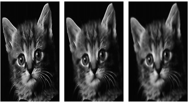</a></td>
<td align="left" width=550>Guided Image Filtering 
<a href="http://kaiminghe.com/">Kaiming He</a>, 
<a href="http://www.jiansun.org/">Jian Sun</a>, 
<a href="https://www.ie.cuhk.edu.hk/people/xotang.shtml">Xiaoou Tang</a> 
In ECCV 2010 
<a href="http://kaiminghe.com/publications/eccv10guidedfilter.pdf">[Paper]</a> 
<a href="http://kaiminghe.com/eccv10/index.html">[Project]</a>
</td></tr></tbody></table>

<table> <tbody> <tr> <td align="left" width=250>
<a href="http://gfx.cs.princeton.edu/pubs/Lipman_2009_MVF/index.php">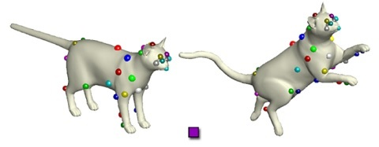</a></td>
<td align="left" width=550>Mobius Voting for Surface Correspondence 
<a href="http://www.wisdom.weizmann.ac.il/~ylipman/">Yaron Lipman</a>, 
<a href="http://www.cs.princeton.edu/~funk/">Thomas Funkhouser</a> 
In SIGGRAPH 2009 
<a href="http://gfx.cs.princeton.edu/pubs/Lipman_2009_MVF/mobius.pdf">[Paper]</a> 
<a href="http://gfx.cs.princeton.edu/pubs/Lipman_2009_MVF/index.php">[Project]</a>
</td></tr></tbody></table>

<table> <tbody> <tr> <td align="left" width=250>
</td>
<td align="left" width=550>Moving Gradients: A Path-Based Method for Plausible Image Interpolation 
<a href="http://www.cs.columbia.edu/~dhruv/">Dhruv Mahajan</a>, 
<a href="https://sites.google.com/site/jonash123/">Fu-Chung Huang</a>, 
<a href="http://people.csail.mit.edu/wojciech/">Wojciech Matusik</a>, 
<a href="https://cseweb.ucsd.edu/~ravir/">Ravi Ramamoorthi</a>, 
<a href="http://www.cs.columbia.edu/~belhumeur/">Peter Belhumeur</a> 
In SIGGRAPH 2009 
<a href="http://people.csail.mit.edu/wojciech/MovingGradients/MovingGradients.pdf">[Paper]</a> 
<a href="http://people.csail.mit.edu/wojciech/MovingGradients/">[Project]</a>
</td></tr></tbody></table>

<table> <tbody> <tr> <td align="left" width=250>
</td>
<td align="left" width=550>Extracting Depth and Matte using a Color-Filtered Aperture 
<a href="http://web.media.mit.edu/~bandy/">Yosuke Bando</a>, 
<a href="http://www.management.ntu.edu.tw/en/teachers/17">Bing-Yu Chen</a>, 
<a href="http://nishitalab.org/user/nis/">Tomoyuki Nishita</a> 
In SIGGRAPH Asia 2008 
<a href="http://web.media.mit.edu/~bandy/rgb/SIGA08rgb.pdf">[Paper]</a> 
<a href="http://web.media.mit.edu/~bandy/rgb/">[Project]</a>
</td></tr></tbody></table>

<table> <tbody> <tr> <td align="left" width=250>
</td>
<td align="left" width=550>Programmable Aperture Photography: Multiplexed Light Field Acquisition 
<a href="http://chiakailiang.org/">Chia-Kai Liang</a>, 
<a href="http://mpac.ee.ntu.edu.tw/~lth/">Tai-Hsu Lin</a>, 
Bing-Yi Wong, 
Chi Liu, 
<a href="http://www.ee.ntu.edu.tw/bio?id=60">Homer Chen</a> 
In SIGGRAPH 2008 
<a href="http://chiakailiang.org/pap/pdf/sig08_preprint.pdf">[Paper]</a> 
<a href="http://chiakailiang.org/pap/">[Project]</a>
</td></tr></tbody></table>

<table> <tbody> <tr> <td align="left" width=250>
</td>
<td align="left" width=550>Structure-Aware Halftoning 
<a href="http://www.cihe.edu.hk/~wmpang/">Wai-Man Pang</a>, 
Yingge Qu, 
<a href="http://www.cse.cuhk.edu.hk/~ttwong/myself.html">Tien-Tsin Wong</a>, 
<a href="http://www.math.tau.ac.il/~dcor/">Daniel Cohen-Or</a>, 
<a href="http://www.cse.cuhk.edu.hk/~pheng/">Pheng-Ann Heng</a> 
In SIGGRAPH 2008 
<a href="https://www.researchgate.net/profile/Wai-Man_Pang/publication/200018906_Structure-Aware_Halftoning/links/02e7e51de74ad05a1b000000.pdf">[Paper]</a> 
<a href="http://www.cse.cuhk.edu.hk/~ttwong/papers/structurehalftone/structurehalftone.html">[Project]</a>
</td></tr></tbody></table>

<table> <tbody> <tr> <td align="left" width=250>
</td>
<td align="left" width=550>Stationary Features and Cat Detection 
<a href="https://www.idiap.ch/~fleuret/">Fran&ccedilois Fleuret</a>, 
<a href="http://www.cis.jhu.edu/people/faculty/geman/">Donald Geman</a> 
In JMLR 2008 
<a href="http://cis.jhu.edu/publications/papers_in_database/GEMAN/Fleuret-Geman_Cats_07.pdf">[Paper]</a> 
</td></tr></tbody></table>

<table> <tbody> <tr> <td align="left" width=250>
</td>
<td align="left" width=550>Cat Head Detection - How to Effectively Exploit Shape and Texture Features 
Weiwei Zhang, 
<a href="http://research.microsoft.com/en-us/people/jiansun/">Jian Sun</a>, 
<a href="http://www.ie.cuhk.edu.hk/people/xotang.shtml">Xiaoou Tang</a> 
In ECCV 2008 
<a href="http://research.microsoft.com/pubs/80582/ECCV_CAT_PROC.pdf">[Paper]</a> 
<a href="http://137.189.35.203/WebUI/CatDatabase/catData.html">[Project]</a>
</td></tr></tbody></table>

<table> <tbody> <tr> <td align="left" width=250>
</td>
<td align="left" width=550>Harmonic Skeleton for Realistic Character Animation 
<a href="http://gregoire.aujay.free.fr/news.php">Gregoire Aujay</a>, 
<a href="http://morpheo.inrialpes.fr/people/hetroy/">Franck Hetroy</a>, 
<a href="http://www.gipsa-lab.grenoble-inp.fr/~francis.lazarus/">Francis Lazarus</a>, 
Christine Depraz 
In Symposium on Computer Animation 2007 
<a href="http://www-evasion.imag.fr/Publications/2007/AHLD07/HarmonicSkeleton.pdf">[Paper]</a> 
<a href="http://www-evasion.imag.fr/Publications/2007/AHLD07/">[Project]</a>
</td></tr></tbody></table>

<table> <tbody> <tr> <td align="left" width=250>
</td>
<td align="left" width=550>Automatic rigging and animation of 3D characters 
<a href="http://www.mit.edu/~ibaran/">Ilya Baran</a>, 
<a href="http://people.csail.mit.edu/jovan/">Jovan Popovic</a> 
In SIGGRAPH 2007 
<a href="http://people.csail.mit.edu/ibaran/papers/2007-SIGGRAPH-Pinocchio.pdf">[Paper]</a> 
<a href="http://www.mit.edu/~ibaran/autorig/">[Project]</a>
</td></tr></tbody></table>

<table> <tbody> <tr> <td align="left" width=250>
</td>
<td align="left" width=550>Mesh Puppetry: Cascading Optimization of Mesh Deformation with Inverse Kinematics 
<a href="https://sites.google.com/site/royitaqi/">Xiaohan Shi</a>, 
<a href="http://www.kunzhou.net/">Kun Zhou</a>, 
<a href="http://www.cse.msu.edu/~ytong/">Yiying Tong</a>, 
<a href="http://www.geometry.caltech.edu/~mathieu/">Mathieu Desbrun</a>, 
<a href="http://www.cad.zju.edu.cn/home/bao/">Hujun Bao</a>, 
<a href="https://www.microsoft.com/en-us/research/people/bainguo/">Baining Guo</a> 
In SIGGRAPH 2007 
<a href="http://citeseerx.ist.psu.edu/viewdoc/download;jsessionid=8E1AD9DB3F200954341D4C96A1F9C9E1?doi=10.1.1.152.7336&rep=rep1&type=pdf">[Paper]</a> 
</td></tr></tbody></table>

<table> <tbody> <tr> <td align="left" width=250>
</td>
<td align="left" width=550>Hybrid Images 
<a href="http://cvcl.mit.edu/">Aude Oliva</a>, 
<a href="http://web.mit.edu/torralba/www/">Antonio Torralba</a>, 
<a href="http://www.gla.ac.uk/researchinstitutes/neurosciencepsychology/staff/philippeschyns/">Philippe G. Schyns</a> 
In SIGGRAPH 2006 
<a href="http://cvcl.mit.edu/hybridimage/hybrid/OlivaTorralb_Hybrid_Siggraph06.pdf">[Paper]</a> 
<a href="http://cvcl.mit.edu/hybridimage/">[Project]</a>
</td></tr></tbody></table>

<table> <tbody> <tr> <td align="left" width=250>
</td>
<td align="left" width=550>Real-Time Video Abstraction 
<a href="http://holgerweb.net/PhD/">Holger Winnemoller</a>, 
<a href="http://www.cs.northwestern.edu/~sco590/">Sven C. Olsen</a>, 
<a href="http://www.cs.northwestern.edu/~bgooch/Publications.html">Bruce Gooch</a> 
In SIGGRAPH 2006 
<a href="http://www.heathershrewsbury.com/dreu2010/wp-content/uploads/2010/07/RealTimeVideoAbstraction.pdf">[Paper]</a> 
<a href="http://holgerweb.net/PhD/Research/VideoAbstraction/">[Project]</a>
</td></tr></tbody></table>

<table> <tbody> <tr> <td align="left" width=250>
</td>
<td align="left" width=550>Spectral Surface Quadrangulation 
Shen Dong, 
<a href="http://faculty.engineering.ucdavis.edu/bremer/">Peer-Timo Bremer</a>, 
<a href="http://mgarland.org/">Michael Garland</a>, 
<a href="http://www.pascucci.org/">Valerio Pascucci</a>, 
<a href="http://graphics.cs.illinois.edu/~jch/">John C. Hart</a> 
In SIGGRAPH 2006 
<a href="http://graphics.cs.illinois.edu/sites/default/files/ssq.pdf">[Paper]</a> 
<a href="http://graphics.cs.illinois.edu/papers/ssq">[Project]</a>
</td></tr></tbody></table>

<table> <tbody> <tr> <td align="left" width=250>
</td>
<td align="left" width=550>Vector Field Design on Surfaces 
<a href="http://web.engr.oregonstate.edu/~zhange/">Eugene Zhang</a>, 
<a href="https://www.math.rutgers.edu/~mischaik/">Konstantin Mischaikow</a>, 
<a href="http://www.cc.gatech.edu/~turk/">Greg Turk</a> 
In ACM Transactions on Graphics (TOG) 2006 
<a href="http://www.math.rutgers.edu/~mischaik/papers/vecflddesn.pdf">[Paper]</a> 
</td></tr></tbody></table>

<table> <tbody> <tr> <td align="left" width=250>
</td>
<td align="left" width=550>Discrete conformal mappings via circle patterns 
Liliya Kharevych, 
<a href="http://page.math.tu-berlin.de/~springb/">Boris Springborn</a>, 
<a href="http://users.cms.caltech.edu/~ps/">Peter Schroder</a> 
In ACM Transactions on Graphics 2006 
<a href="http://www.cs.jhu.edu/~misha/Fall09/Kharevych06.pdf">[Paper]</a> 
</td></tr></tbody></table>

<table> <tbody> <tr> <td align="left" width=250>
</td>
<td align="left" width=550>Large mesh deformation using the volumetric graph Laplacian 
<a href="http://www.kunzhou.net/">Kun Zhou</a>, 
<a href="http://www.cad.zju.edu.cn/home/hj/index.xml">Jin Huang</a>, 
<a href="http://research.microsoft.com/en-us/um/people/johnsny/">John Snyder</a>, 
<a href="http://www.cad.zju.edu.cn/home/xgliu/">Xinguo Liu</a>, 
<a href="http://www.cad.zju.edu.cn/home/bao/">Hujun Bao</a>, 
<a href="https://www.microsoft.com/en-us/research/people/bainguo/">Baining Guo</a>, 
<a href="https://news.microsoft.com/exec/harry-shum/#sm.0000132byn4sagcq3zb3rckw1y2ny">Heung-Yeung Shum</a> 
In SIGGRAPH 2005 
<a href="https://www.microsoft.com/en-us/research/publication/large-mesh-deformation-using-the-volumetric-graph-laplacian/">[Paper]</a> 
</td></tr></tbody></table>

<table> <tbody> <tr> <td align="left" width=250>
</td>
<td align="left" width=550>TextureMontage: Seamless Texturing of Arbitrary Surfaces From Multiple Images 
<a href="http://www.kunzhou.net/">Kun Zhou</a>, 
Xi Wang, 
<a href="http://www.cse.msu.edu/~ytong/">Yiying Tong</a>, 
<a href="http://www.geometry.caltech.edu/~mathieu/">Mathieu Desbrun</a>, 
<a href="https://www.microsoft.com/en-us/research/people/bainguo/">Baining Guo</a>, 
<a href="https://news.microsoft.com/exec/harry-shum/#sm.0000132byn4sagcq3zb3rckw1y2ny">Heung-Yeung Shum</a> 
In SIGGRAPH 2005 
<a href="http://kunzhou.net/publications/texturemontage.pdf">[Paper]</a> 
</td></tr></tbody></table>

<table> <tbody> <tr> <td align="left" width=250>
</td>
<td align="left" width=550>Deformation Transfer for Triangle Meshes 
<a href="https://graphics.ethz.ch/~sumnerb/">Robert W. Sumner</a>, 
<a href="http://www.adobe.com/technology/people/seattle/jovan-popovic.html">Jovan Popovic</a> 
In SIGGRAPH 2004 
<a href="http://people.csail.mit.edu/sumner/research/deftransfer/Sumner2004DTF.pdf">[Paper]</a> 
<a href="http://people.csail.mit.edu/sumner/research/deftransfer/">[Project]</a>
</td></tr></tbody></table>

<table> <tbody> <tr> <td align="left" width=250>
</td>
<td align="left" width=550>Stereological Techniques for Solid Textures 
<a href="http://robjagnow.com/">Robert Jagnow</a>, 
<a href="http://graphics.cs.yale.edu/site/people/julie-dorsey">Julie Dorsey</a>, 
<a href="http://graphics.cs.yale.edu/site/people/holly-rushmeier/">Holly Rushmeier</a> 
In ACM Transactions on Graphics (TOG) 2004 
<a href="http://graphics.cs.yale.edu/site/sites/files/Stereological%20Techniques.pdf">[Paper]</a> 
<a href="http://graphics.cs.yale.edu/site/publications/stereological-techniques-solid-textures?destination=node%2F57">[Project]</a>
</td></tr></tbody></table>

<table> <tbody> <tr> <td align="left" width=250>
</td>
<td align="left" width=550>A Procedural Approach to Authoring Solid Models 
<a href="http://www.cs.rpi.edu/~cutler/">Barbara Cutler</a>, 
<a href="http://graphics.cs.yale.edu/site/people/julie-dorsey/">Julie Dorsey</a>, 
<a href="http://www.csbio.unc.edu/mcmillan/index.py">Leonard McMillan</a>, 
<a href="http://matthias-mueller-fischer.ch/">Matthias Mueller</a>, 
<a href="http://www.robjagnow.com/">Robert Jagnow</a> 
In SIGGRAPH 2002 
<a href="http://people.csail.mit.edu/bmcutler/PROJECTS/SIGGRAPH02/papers_0040_final.pdf">[Paper]</a> 
<a href="http://people.csail.mit.edu/bmcutler/PROJECTS/SIGGRAPH02/">[Project]</a>
</td></tr></tbody></table>

<table> <tbody> <tr> <td align="left" width=250>
</td>
<td align="left" width=550>Feature-based light field morphing 
Zhunping Zhang, 
 Lifeng Wang, 
<a href="https://www.microsoft.com/en-us/research/people/bainguo/"> Baining Guo</a>, 
<a href="https://news.microsoft.com/exec/harry-shum/#sm.0000132byn4sagcq3zb3rckw1y2ny">Heung-Yeung Shum</a> 
In SIGGRAPH 2002 
<a href="http://dl.acm.org/citation.cfm?id=566602">[Paper]</a> 
</td></tr></tbody></table>

<table> <tbody> <tr> <td align="left" width=250>
</td>
<td align="left" width=550>Synthesis of Bidirectional Texture Functions on Arbitrary Surfaces 
<a href="http://research.microsoft.com/en-us/um/people/xtong/xtong.html">Xin Tong</a>, 
Jingdan Zhang, 
<a href="http://staff.ustc.edu.cn/~lgliu/"> Ligang Liu</a>, 
Xi Wang, 
<a href="https://www.microsoft.com/en-us/research/people/bainguo/">Baining Guo</a>, 
<a href="https://news.microsoft.com/exec/harry-shum/#sm.0000132byn4sagcq3zb3rckw1y2ny"> Heung-Yeung Shum</a> 
In SIGGRAPH 2002 
<a href="http://www.msr-waypoint.com/en-us/um/people/xtong/BTFSynthesis.pdf">[Paper]</a> 
</td></tr></tbody></table>

<table> <tbody> <tr> <td align="left" width=250>
</td>
<td align="left" width=550>Smoothing an Overlay Grid to Minimize Linear Distortion in Texture Mapping 
<a href="http://www.cs.ubc.ca/~sheffa/">Alla Sheffer</a>, 
<a href="http://www.math.vt.edu/people/sturler/">Eric de Sturler</a> 
In ACM Transactions on Graphics (TOG) 2002 
<a href="http://citeseerx.ist.psu.edu/viewdoc/download?doi=10.1.1.101.2205&rep=rep1&type=pdf">[Paper]</a> 
</td></tr></tbody></table>

<table> <tbody> <tr> <td align="left" width=250>
</td>
<td align="left" width=550>A Signal-Processing Framework for Inverse Rendering 
<a href="https://cseweb.ucsd.edu/~ravir/">Ravi Ramamoorthi</a>, 
<a href="https://graphics.stanford.edu/~hanrahan/">Pat Hanrahan</a> 
In SIGGRAPH 2001 
<a href="https://graphics.stanford.edu/papers/invrend/invrend.pdf">[Paper]</a> 
<a href="https://graphics.stanford.edu/papers/invrend/">[Project]</a>
</td></tr></tbody></table>

<table> <tbody> <tr> <td align="left" width=250>
</td>
<td align="left" width=550>Real-Time Fur over Arbitrary Surfaces 
Jerome E. Lengyel, 
<a href="http://www.cs.utah.edu/~emilp/">Emil Praun</a>, 
<a href="https://www.cs.princeton.edu/~af/">Adam Finkelstein</a>, 
<a href="http://research.microsoft.com/en-us/um/people/hoppe/">Hugues Hoppe</a> 
In SIGGRAPH 2001 
<a href="http://people.csail.mit.edu/ericchan/bib/pdf/p227-lengyel.pdf">[Paper]</a> 
</td></tr></tbody></table>

<table> <tbody> <tr> <td align="left" width=250>
</td>
<td align="left" width=550>Texture Synthesis over Arbitrary Manifold Surfaces 
<a href="http://www.liyiwei.org/">Li-Yi Wei</a>, 
<a href="http://graphics.stanford.edu/~levoy/">Marc Levoy</a> 
In SIGGRAPH 2001 
<a href="http://graphics.stanford.edu/papers/texture-synthesis-sig01/texture.pdf">[Paper]</a> 
<a href="http://graphics.stanford.edu/papers/texture-synthesis-sig01/">[Project]</a>
</td></tr></tbody></table>

<table> <tbody> <tr> <td align="left" width=250>
</td>
<td align="left" width=550>A Markovian framework for digital halftoning 
<a href="https://people.cs.clemson.edu/~geist/homepage.html">Robert Geist</a>, 
Robert Reynolds, 
Darrell Suggs 
In ACM Transactions on Graphics (TOG) 1993 
<a href="http://dl.acm.org/citation.cfm?id=151281">[Paper]</a> 
</td></tr></tbody></table>

<table> <tbody> <tr> <td align="left" width=250>
</td>
<td align="left" width=550>Some informational aspects of visual perception 
<a href="http://psycnet.apa.org/index.cfm?fa=buy.optionToBuy&id=1994-31267-001">Fred Attneave</a> 
In Psychological Review 1954 
<a href="http://web.mit.edu/persci/classes/papers/Attneave54.pdf">[Paper]</a> 
</td></tr></tbody></table>

 

Last updated in Jul 2022
 

